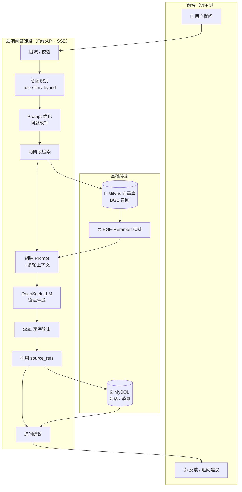
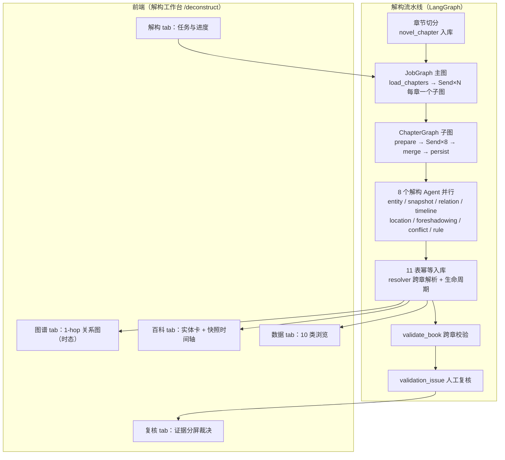

# AI 智能客服 + 小说解构知识图谱系统

[](https://www.python.org/)
[](https://fastapi.tiangolo.com/)
[](https://vuejs.org/)
[](https://milvus.io/)
[](https://www.deepseek.com/)
[](https://www.mysql.com/)
[](https://langchain-ai.github.io/langgraph/)
[](LICENSE)

一个**双子系统**系统：**① AI 智能客服 + RAG（检索增强生成）**——上传企业知识文档后，用户通过自然语言问答获得带引用来源的流式回答，支持多会话、意图识别、追问引导与用户反馈；**② 小说解构 / 知识图谱**——上传小说后，系统用 LangGraph 图编排 + 9 个 AI Agent 逐章解构成结构化知识（实体/关系/时间线/伏笔/冲突/规则），支持知识图谱浏览、实体百科、时态回放与人工复核。

---

## 📑 目录

- [项目简介](#-项目简介)
- [功能特性](#-功能特性)
- [技术栈](#-技术栈)
- [架构概览](#-架构概览)
- [目录结构](#-目录结构)
- [快速开始](#-快速开始)
- [访问入口](#-访问入口)
- [环境变量配置](#-环境变量配置)
- [数据库初始化](#-数据库初始化)
- [测试](#-测试)
- [文档导航](#-文档导航)
- [API 概览](#-api-概览)
- [设计模式](#-设计模式)
- [常见问题 / 已知问题](#-常见问题--已知问题)
- [License](#-license)

---

## 🎯 项目简介

**定位**：企业 AI 智能客服 + RAG **与** 小说解构 / 知识图谱的双子系统。前者解决"知识库问答"痛点——员工或客户在业务文档中查找信息效率低，通用 AI 缺乏对私有知识的理解；后者解决"小说结构化"痛点——把一部小说的实体、关系、剧情时间线、伏笔、冲突、规则解构成可查询、可回放、可复核的知识图谱。

**核心闭环一句话**：上传知识 → 问答 → 引用 → 反馈/追问（客服）；上传小说 → 解构 → 图谱/百科浏览 → 复核（解构）。

用户将 `.txt` / `.md` / `.pdf` 文档上传到知识库，系统自动完成分块、向量化与入库；用户提问后，系统经意图识别、问题优化、两阶段检索召回相关内容，由大模型流式生成带引用卡片的回答；回答可被赞/踩反馈，并生成可点击的追问建议，形成可持续优化的客服闭环。同时，用户可将小说上传并一键解构：系统把每章切成场景，经 LangGraph 图编排让 8 个解构 Agent 并行抽取实体/快照/关系/时间线/地点/伏笔/冲突/规则，校验后幂等入库，再经一致性校验与人工复核，形成可核验的小说知识图谱。

---

## ✨ 功能特性

**用户 / 会话**

- 注册登录：手机号或邮箱注册，JWT 认证（`python-jose` + bcrypt 密码散列）
- 多会话：每个用户独立管理多个会话，会话自动命名（取首条消息前 20 字）
- 历史会话：会话列表、会话详情（完整消息历史）随时回看
- 消息反馈：每条回答可点赞/点踩，并附文字说明，落库可回溯

**RAG 问答**

- 文档入库：`.txt` / `.md` / `.pdf` 上传 → 分块 → Embedding → Milvus 向量库
- 两阶段检索：BGE 向量召回 top-N → Cross-Encoder 精排 top-K，兼顾速度与精度
- LLM 流式回答：DeepSeek 深度思考 + SSE 逐字输出，区分思考链与正式回答
- 引用卡片：回答携带 `source_refs`（来源文件 / 书名 / chunk），前端按文件分组折叠展示
- 多轮上下文：保留最近 N 轮对话并按字符预算裁剪，回答有上下文感知

**知识库管理**

- 上传状态机：`processing → ready / failed`，前端轮询进度
- 书分组：按 `book_name` 分组展示书籍与文件，可选中查看
- 双删：单文件删除、整本书删除均同步清理 Milvus 向量与 MySQL 记录（幂等 204）
- 增量去重：`content_hash` 精确去重 + 可选向量语义去重，避免重复入库

**小说解构 / 知识图谱**

- 章节解构：小说上传（`deconstruct=1`）或一键解构，LangGraph 图编排（JobGraph → ChapterGraph）逐章并行解构
- 8 个并行解构 Agent：实体 / 快照 / 关系 / 时间线 / 地点 / 伏笔 / 冲突 / 规则；每类知识一套结构化抽取 Prompt 工程（skills）——base 铁律（只按原文/只出 JSON/不编造/缺省 null）+ 专属枚举与判定边界 + 3-shot 跨题材 Few-shot 示例（2 正 1 错）+ Pydantic JSON Schema 强校验 + source_fragment 原文锚定
- 增量提取与跨章对齐：entity_snapshot 注入上一章已入库快照（prev_snapshot_context）只输出变化；hint_entities 跨章命名对齐名单防止同物异名
- 结构化知识库：19 张 MySQL 表（含 15 张解构表），幂等入库 + 跨章生命周期（关系/冲突/规则合并去重）
- 知识图谱：1-hop 关系图，时态 as-of N 可回放
- 实体百科：实体卡 + 快照演化时间轴 + 出场热力图，章节滑块时态切换
- 实体卡饱满度（二阶段）：L0-L4 五区（身份锚点 / 静态基线 / 当前状态 / 聚合弧光 / 伏笔规则·明暗）+ 三态标注（原文直证/合理推断/待复核）+ 状态累积回填（逐属性最近非空）+ 置信度弱视觉
- 数据浏览：10 类结构化数据分页 + 字段筛选/模糊查询
- Agent 可靠性体系（Guardrails）：三层校验（Layer 0/1 确定性 + Layer 2 validator Agent 批校验）+ confidence 置信度闭环 + 人工复核工作台（原文证据分屏裁决）+ savepoint 隔离 + 乐观锁多进程守卫

**加分项**

- 意图识别：5 类标注（产品咨询 / 售后问题 / 闲聊 / 投诉 / 其他），`rule → llm → hybrid` 三策略
- 追问引导：回答结束后生成可点击的建议问题，点击即发送到当前会话

**工程能力**

- 每日限流：按用户统计当日提问次数，超限返回 429
- 空检索兜底：知识库无命中时降级为模型自身知识回答，仍为空则返回兜底文案
- MCP 工具设计开发：设计并开发 4 个 FastMCP 工具（RAG 检索 / 入库 / 删除 + 天气查询），由 LLM 经 Function Calling 动态调用，子进程常驻复用
- SSE 逐字输出：`status / thinking / intent / tool / answer / followup / done` 多事件流
- 可观测性：events.py 事件总线 + SSE 进度流（job/chapter/agent 三级）+ request_id 全链路日志追踪
- LLM 结构化输出鲁棒性：JSON 容错解析（剥围栏 / 平衡块 / 数组包裹）+ Pydantic 强校验 + 缩窗重试 + 低温 0.0
- 网页爬虫：单页 / 批量抓取 + 小说章节发现与批量下载（Playwright 双模式）

---

## 🛠 技术栈

| 类别          | 技术                                      | 版本           |
| ------------- | ----------------------------------------- | -------------- |
| 后端框架      | FastAPI + SSE 流式                        | 0.140          |
| LLM           | DeepSeek（deepseek-v4-flash，深度思考）   | API            |
| Embedding     | BAAI/bge-small-zh-v1.5                    | 本地部署       |
| Reranker      | BAAI/bge-reranker-v2-m3                   | 本地部署       |
| 向量数据库    | Milvus                                    | 2.6.19         |
| 数据库        | MySQL                                     | 8.0            |
| ORM           | SQLAlchemy + PyMySQL                      | 2.0.32 / 1.1.1 |
| RAG 框架      | LangChain                                 | 1.3.13         |
| MCP 协议      | FastMCP / langchain-mcp-adapters          | 3.4.4 / 0.3.0  |
| 认证          | python-jose（JWT）+ passlib（bcrypt）     | 3.3.0 / 1.7.4  |
| 前端          | Vue 3 + Vite（JavaScript）                | 3.5 / 6        |
| 前端路由      | vue-router                                | 4.5            |
| Markdown 渲染 | marked                                    | 15             |
| 代码高亮      | highlight.js                              | 11             |
| 爬虫          | Playwright + BeautifulSoup 4              | 1.60 / 4.14    |
| 测试          | pytest                                    | 8.3            |
| 运行环境      | Python 3.11 / Node 20 / Docker Compose V2 | —             |
| 图编排（解构） | LangGraph                                | 1.x（Graph State/Send/reducer） |
| 图可视化（前端） | @relation-graph/vue                     | 3.1            |
| UI 组件库（前端） | naive-ui                               | 2.45           |
| 图标（前端）    | lucide-vue-next                           | 1.0            |

---

## 🏗 架构概览



一句话链路：用户提问经限流校验后，先做意图识别与问题优化，再由 BGE 向量召回 + Cross-Encoder 精排从知识库取出相关内容，组装进 Prompt 交给 DeepSeek 流式生成回答；回答逐字输出并携带引用来源，最终消息与会话落库到 MySQL，并触发追问建议，形成完整闭环。

**解构子系统链路**：小说上传（`deconstruct=1`）→ 章节切分入库 → LangGraph 图编排（JobGraph 整书 → ChapterGraph 单章 → 8 个解构 Agent 并行抽取）→ 校验归并 → 11 表幂等入库 → 跨章一致性校验 → 人工复核 → 知识图谱 / 实体百科浏览。全程经 events.py 事件总线 + SSE 进度流可观测。



---

## 📂 目录结构

```
006gaizao/
├── backend/                    # 后端
│   ├── src/                    # FastAPI 源码
│   │   ├── main_fastapi.py     #   入口：lifespan 启动 + 健康检查 + 路由挂载（含 /api/novel）
│   │   ├── config.py           #   集合注册表 + Schema/索引定义
│   │   ├── app_state.py        #   全局应用状态（单例）
│   │   ├── core/               #   依赖注入 / JWT / 意图识别 / Prompt 优化 / 异常 / prompts
│   │   ├── db/                 #   SQLAlchemy engine + ORM 模型（users/sessions/messages/documents）
│   │   ├── routers/            #   auth / chat / documents / sessions / crawler / novel
│   │   ├── LLM/                #   LLM 适配器 + 记忆适配器（含 MysqlMemoryAdapter）
│   │   ├── MCP_SERVER/         #   FastMCP 子进程服务（RAG 工具 / 天气）
│   │   ├── RAG/                #   文档加载 / 分块 / Embedding / 两阶段检索 / Milvus
│   │   ├── novel/              #   小说解构子系统：agents（8+1）/ prompts（10）/ persistence / pipeline / graph（LangGraph）/ orchestrator / llm_runner / events
│   │   └── UTILS/              #   WSL 适配 / 雪花 ID / 爬虫引擎
│   ├── scripts/                #   init_db.sql（19 表）/ rollback.sql / migration_confidence.sql / 回填脚本
│   ├── tests/                  #   pytest 用例（隔离测试库 ai_customer_service_test；57 个测试文件）
│   └── requirements.txt
├── frontend/                   # 前端（Vue 3 + Vite + Naive UI）
│   └── src/
│       ├── api/                #   统一 API 封装（fetch + SSE 流式；novel.js 封装解构 API）
│       ├── views/              #   ChatView / IngestView / CrawlerView / LoginView / NovelWorkspaceView（解构工作台）/ GraphView / EntityView / KnowledgeBrowserView / ReviewView / ReviewDesk / NovelJobsView / NovelJobDetail / BookWorkbench
│       └── components/         #   MessageList / ChatInput / SessionList / FileSelector / EntityCardPanel / SnapshotTimeline / AppearanceHeatmap / EvidencePanel / ChapterSlider / TimelinePanel / SemanticLayerBar / DeconstructPanel / StatusBadge
├── DEPLOY/                     # Docker 部署
│   ├── docker-compose.yml              #   全栈编排（backend/frontend/mysql/milvus/etcd/minio/attu）
│   ├── docker-compose.gpu.yml          #   GPU 覆盖配置
│   ├── docker-compose.milvus-only.yml  #   仅向量库（etcd/minio/milvus/attu）
│   ├── docker-compose.mysql-only.yml   #   仅 MySQL（开发用）
│   ├── Dockerfile.backend / Dockerfile.frontend
│   └── nginx.conf
└── docs/                       # 文档（见「文档导航」）
```

---

## 🚀 快速开始

### 环境要求

- Docker 24+ 与 Docker Compose V2（Docker 全栈部署时需要）
- Python 3.11（本地开发后端）
- Node.js 20+（本地开发前端）
- GPU 可选（Embedding + Reranker 本地推理，无 GPU 走 CPU）

### ① 配置环境变量

```bash
cp backend/src/.env.example backend/src/.env
```

编辑 `backend/src/.env`，至少填写：

- `DeepSeek_API_KEY`等 —— LLM 调用密钥
- `MYSQL_PASSWORD` / `MYSQL_ROOT_PASSWORD` / `MYSQL_HOST` / `MYSQL_PORT`
- `JWT_SECRET` —— 建议 32 位以上随机串
- 首次启动将 `HF_HUB_OFFLINE` 置为 `0`，让 Embedding / Reranker 模型先联网下载缓存

### ② 本地开发：后端

```bash
cd backend/src
uvicorn main_fastapi:app --host 0.0.0.0 --port 8000
```

本地开发需要可用的 MySQL 与 Milvus。可用仓库内的单机编排快速拉起：

```bash
docker compose -f DEPLOY/docker-compose.mysql-only.yml up -d   # MySQL，127.0.0.1:3306
docker compose -f DEPLOY/docker-compose.milvus-only.yml up -d  # Milvus，127.0.0.1:19530
```

### ③ 本地开发：前端

```bash
cd frontend
npm install
npm run dev
```

访问 http://localhost:5173 ，`/api` 请求由 Vite 代理转发到后端 8000 端口。

### ④ Docker 全栈部署

```bash
docker compose -f DEPLOY/docker-compose.yml up -d
# 有 GPU 时叠加覆盖文件
docker compose -f DEPLOY/docker-compose.yml -f DEPLOY/docker-compose.gpu.yml up -d
```

Docker 编排包含 7 个服务：`backend`（FastAPI）、`frontend`（Nginx，80 端口）、`mysql`（8.0）、`milvus`（2.6.19）及其依赖 `etcd` / `minio`，外加管理台 `attu`（3000 端口）。

### ⑤ 验证

```bash
docker compose -f DEPLOY/docker-compose.yml ps   # 所有服务应为 healthy
curl http://localhost/api/health                  # 返回 {"status":"ok"}
```

浏览器访问 http://localhost ，注册账号后，先在「知识库管理」页面上传文档，再到对话页面提问即可。

> 爬虫功能需要 Playwright 浏览器内核：`playwright install chromium`。

> 完整运行步骤（本地 conda / 无 conda、Docker 全栈、全量环境变量与 FAQ）见 [运行指南.md](运行指南.md)。

---

## 🖥 访问入口

系统各界面启动后可按下表访问：

| 界面                | 本地开发                         | Docker 部署                             | 说明                                                                                                         |
| ------------------- | -------------------------------- | --------------------------------------- | ------------------------------------------------------------------------------------------------------------ |
| 前端 Web            | http://localhost:5173            | http://localhost                        | 页面路由：`/chat` 对话、`/ingest` 知识库管理、`/crawler` 爬虫、`/deconstruct` 解构工作台（解构/复核/图谱/百科/数据 5 tab）、`/login` 登录（未登录自动跳转登录页） |
| 后端 API 交互文档   | http://localhost:8000/docs       | http://localhost:8000/docs              | FastAPI 自动生成的 Swagger UI（另有`/redoc`）                                                              |
| 后端健康检查        | http://localhost:8000/api/health | http://localhost/api/health（经 Nginx） | 返回`{"status":"ok"}`                                                                                      |
| Milvus 可观测管理台 | http://localhost:3000            | http://localhost:3000                   | Attu（zilliz）：查看集合、向量、索引与性能                                                                   |
| MySQL               | 127.0.0.1:3306                   | 127.0.0.1:3306                          | 无 Web UI，用 Navicat /`mysql` 客户端连接；账号密码见 `backend/src/.env`                                 |

几点说明：

- 后端 `/docs` 交互文档需要后端已启动（本地 `8000` 或 Docker backend 服务）。
- Attu 需要 Milvus 栈已启动（全栈 `docker-compose.yml` 或 `milvus-only` 编排）。
- Milvus 本体仅暴露 gRPC 端口 `19530` 供 SDK 连接，无浏览器 UI；可视化观测统一走 Attu。
- MySQL 无 Web 管理界面，使用客户端连接 `127.0.0.1:3306`，账号密码取自 `backend/src/.env` 的 `MYSQL_USER` / `MYSQL_PASSWORD`。

---

## ⚙️ 环境变量配置

`backend/src/.env` 按分组说明（完整逐参数清单、必填项与本地/Docker 启动见 [运行指南.md](运行指南.md)）：

| 分组        | 变量                                                                                                                                                           | 说明 / 默认                               |
| ----------- | -------------------------------------------------------------------------------------------------------------------------------------------------------------- | ----------------------------------------- |
| LLM         | `DeepSeek_API_KEY` / `DeepSeek_API_URL`                                                                                                                    | DeepSeek API 密钥与地址                   |
| Embedding   | `EMBEDDING_MODEL_NAME` / `VEC_DIM`                                                                                                                         | `BAAI/bge-small-zh-v1.5` / `512`      |
| HuggingFace | `HF_HUB_OFFLINE`                                                                                                                                             | 离线跳过模型下载（首启置 0）              |
| Milvus      | `MILVUS_PORT` / `MANUAL_MILVUS_HOST` / `AUTO_GET_WIN_HOST_IP`                                                                                            | 连接参数；WSL 下自动取宿主 IP             |
| MySQL       | `MYSQL_HOST` / `MYSQL_PORT` / `MYSQL_USER` / `MYSQL_PASSWORD` / `MYSQL_DB`                                                                           | 业务库连接（默认`ai_customer_service`） |
| JWT         | `JWT_SECRET` / `JWT_EXPIRE_MINUTES`                                                                                                                        | 令牌签名与有效期（默认 1440 分钟）        |
| 问答链路    | `PROMPT_OPTIMIZE_ENABLED` / `TOP_K_RETRIEVE` / `TOP_K_RERANK` / `DAILY_QUOTA` / `CONTEXT_MAX_CHARS` / `HISTORY_RECENT_TURNS` / `FALLBACK_COPY`   | 检索参数、每日限额、上下文预算、兜底文案  |
| 加分项      | `INTENT_ENABLED` / `INTENT_MODE` / `INTENT_TIMEOUT`、`FOLLOWUP_ENABLED` / `FOLLOWUP_SUGGESTION_COUNT` / `FOLLOWUP_TIMEOUT`、`SESSION_AUTO_TITLE` | 意图识别与追问建议开关、会话自动命名      |

注意：`.env.example` 中 `EMBEDDING_MODEL_NAME` / `VEC_DIM` 存在重复定义、`MILVUS_PORT` 为占位符，请以实际需要的值填写。

---

## 🗄 数据库初始化

数据库初始化脚本位于 `backend/scripts/init_db.sql`，创建库 `ai_customer_service`、**19 张表**（4 张基础表 `users` / `sessions` / `messages` / `documents` + 15 张解构表 `novel_chapter` / `deconstruct_job` / `deconstruct_chapter_state` / `entity` / `entity_alias` / `location` / `entity_snapshot` / `entity_relation` / `timeline_event` / `timeline_event_entity` / `location_snapshot` / `foreshadowing` / `story_conflict` / `rule_check` / `validation_issue`）与**内置基础用户**（手机号 `12345678910` / 密码 `1234567`，`INSERT IGNORE` 幂等）。旧库升级时另执行 `backend/scripts/migration_confidence.sql`（为解构表幂等补 `confidence`/`review_status` 列）。

- Docker 部署：MySQL 容器首次启动时经 `docker-entrypoint-initdb.d` 自动执行该脚本
- 手动初始化：

```bash
mysql -u root -p ai_customer_service < backend/scripts/init_db.sql
```

---

## ✅ 测试

```bash
cd backend
pytest        # 或 conda run -n env_agent001 python -m pytest
```

测试使用隔离的测试库 `ai_customer_service_test`（`tests/conftest.py` 自动创建并授权），不会污染业务库；`pytest.ini` 已配置 `pythonpath=src` 与 `testpaths=tests`。当前 **57 个测试文件 / 395 个用例**（2026-08-18 在 `env_agent001` 环境 `pytest --collect-only` 实测；覆盖 RAG 链路与小说解构全链路）。

---

## 📚 文档导航

| 文档                 | 位置                                                        | 内容                                    |
| -------------------- | ----------------------------------------------------------- | --------------------------------------- |
| API 文档             | [docs/API文档.md](docs/API文档.md)                           | 全部接口契约、SSE 事件载荷（含 /api/novel/*）              |
| 数据库设计           | [docs/数据库设计.md](docs/数据库设计.md)                     | 19 张表（4 基础 + 15 解构）字段 / 关系 / 索引                |
| AI 架构设计          | [docs/AI架构设计.md](docs/AI架构设计.md)                     | RAG 链路 + 解构流水线架构、组件机制、质量评估            |
| 业务流程说明         | [docs/业务流程说明.md](docs/业务流程说明.md)                 | 对话 / 入库 / 反馈业务处理流程 + 小说解构业务流          |
| 项目说明             | [项目说明.md](项目说明.md)                                   | 技术选型、AI 工程思考、AI 工具体会、终极挑战 |
| 运行指南             | [运行指南.md](运行指南.md)                                   | 环境要求、本地/Docker 启动、全量环境变量、FAQ（含 NOVEL_*） |
| 工程文档             | [docs/开发阶段文档/工程文档/](docs/开发阶段文档/工程文档/)   | 工程执行 Spec（含"7 份旧文档对齐双子系统"更新计划） |
| 开发阶段文档         | [docs/开发阶段文档/](docs/开发阶段文档/)                     | spec 子任务、分析文档、文档补齐、流水线说明 |

---

## 🌐 API 概览

完整契约见 [docs/API文档.md](docs/API文档.md)。以下为路由分组概览：

| 分组   | 方法   | 路径                                               | 说明                                             |
| ------ | ------ | -------------------------------------------------- | ------------------------------------------------ |
| 认证   | POST   | `/api/auth/register`                             | 注册（手机号 / 邮箱）                            |
| 认证   | POST   | `/api/auth/login`                                | 登录，返回 JWT                                   |
| 问答   | GET    | `/api/chat/stream`                               | SSE 流式对话（意图 / 思考 / 回答 / 引用 / 追问） |
| 问答   | GET    | `/api/chat/history`                              | 会话消息历史                                     |
| 会话   | GET    | `/api/sessions`                                  | 当前用户会话列表                                 |
| 会话   | GET    | `/api/sessions/{session_id}/messages`            | 会话完整消息                                     |
| 反馈   | POST   | `/api/messages/{msg_id}/feedback`                | 消息赞/踩 + 文字                                 |
| 知识库 | POST   | `/api/documents/upload`                          | 上传`.txt/.md/.pdf` 异步入库                   |
| 知识库 | GET    | `/api/documents`                                 | 文档列表（可按 book_name 过滤）                  |
| 知识库 | GET    | `/api/documents/books`                           | 书籍分组列表                                     |
| 知识库 | DELETE | `/api/documents/{doc_id}`                        | 删除单文件（Milvus + MySQL）                     |
| 知识库 | DELETE | `/api/documents/books/{book_name}`               | 删除整本书（Milvus + MySQL）                     |
| 爬虫   | POST   | `/api/crawler/fetch` / `/batch`                | 单页 / 批量抓取                                  |
| 爬虫   | POST   | `/api/crawler/novel/chapters` / `/novel/crawl` | 章节发现 / 批量下载                              |
| 解构   | GET    | `/api/novel/books/{book_id}/jobs`              | 解构任务列表 / 详情 / 章节列表                   |
| 解构   | POST   | `/api/novel/books/{book_id}/deconstruct`       | 一键解构（202 新 job）                           |
| 解构   | POST   | `/api/novel/jobs/{job_id}/retry`               | 重试失败章                                       |
| 解构   | GET    | `/api/novel/jobs/{job_id}/stream`              | 解构进度 SSE 流                                  |
| 解构   | GET    | `/api/novel/books/{book_id}/query` / `browse/{type}` | 结构化查询 / 10 类数据浏览               |
| 解构   | GET    | `/api/novel/books/{book_id}/knowledge/*`       | Knowledge API：图谱 / 实体卡 / 时间线 / 证据 / 快照（时态 as-of N） |
| 解构   | GET/POST | `/api/novel/.../validation*`                 | 复核待办 / confirm / ignore / fix / repersist    |
| 健康   | GET    | `/api/health`                                    | 健康检查`{"status":"ok"}`                      |

> 旧 `/api/ingest/*` 路由已废弃（前端已迁移至 `/api/documents/*`），不再注册。

---

## 🎨 设计模式

项目广泛使用软件设计模式，体现生产级工程实践。以下模式均在当前代码中可定位到具体实现：

| 模式                          | 应用位置                                                                                                                                                                                                                                                                   | 说明                                                                                 |
| ----------------------------- | -------------------------------------------------------------------------------------------------------------------------------------------------------------------------------------------------------------------------------------------------------------------------- | ------------------------------------------------------------------------------------ |
| **适配器模式**          | `LLM/llm_adapters.py`、`RAG/embedding_adapters.py`、`RAG/rerank_adapter.py`、`LLM/memory_adapters.py`                                                                                                                                                              | LLM / Embedding / Reranker / Memory 四大适配器体系，统一接口、多后端互换             |
| — 适配器（MySQL→LangChain） | `MysqlMemoryAdapter` + `SqlChatMessageHistory`（memory_adapters.py:232）                                                                                                                                                                                               | 把 MySQL 会话/消息适配成 LangChain`BaseChatMessageHistory`                         |
| — 适配器（MCP→工具）        | `PersistentMCPTool`（MCP_SERVER/MCP_utils.py:131）                                                                                                                                                                                                                       | 把 MCP`call_tool` 适配为 `tool.ainvoke()`                                        |
| **工厂模式**            | `create_llm_adapter`（llm_adapters.py:364）、`create_memory_adapter`（memory_adapters.py:440）、`create_embedding_adapter`（embedding_adapters.py:342）、`create_rerank_adapter`（rerank_adapter.py:157）、`create_document_splitter`（RAG/TextSplitter.py:393） | 一行代码切换实现（deepseek/grok、memory/file/mysql、load/openai/ollama…）           |
| **模板方法模式**        | `BaseDocumentLoader.load()`（RAG/DocumentLoader.py:135）                                                                                                                                                                                                                 | 固定加载流程（校验→解析→清洗→过滤→注入元数据），子类只实现抽象`_parse_content` |
| **注册表模式**          | `COLLECTION_REGISTRY`（config.py:116）                                                                                                                                                                                                                                   | 集中管理集合元数据（key`content` → 集合 `content_knowledge`），新增集合只加一项 |
| **策略模式**            | `classify_intent`（core/intent_classifier.py:105）、`search_Milvus`（RAG/RAG_Milvus_utils.py）                                                                                                                                                                         | 意图识别 rule / llm / hybrid 三策略运行时选择；两阶段检索可选 reranker               |
| **单例模式**            | `AppState`（app_state.py:18）、DB engine（db/__init__.py:39）、`SnowflakeGenerator`（UTILS/snowflake.py:32）、`PlaywrightBrowserManager`（UTILS/crawler_utils.py:44）                                                                                          | 进程级共享状态：LLM/Milvus/MCP 客户端、连接池、雪花 ID、浏览器                       |
| **依赖注入**            | `Depends(get_db)` / `get_current_user`（core/deps.py:26）                                                                                                                                                                                                              | 路由与数据层解耦，会话/认证注入                                                      |
| **装饰器模式**          | `guard_unloaded`（LLM/memory_adapters.py:25）、`retry_on_failure`（RAG/RAG_Milvus_utils.py:89）                                                                                                                                                                        | 横切关注点：僵尸实例防护、指数退避重试                                               |
| **门面模式**            | `core/prompts/__init__.py`、`RAG/__init__.py`                                                                                                                                                                                                                          | 统一入口 + YAML 缺失兜底；RAG 类统一再导出                                           |

---

## ❓ 常见问题 / 已知问题

- **首次启动卡在模型下载**：Embedding / Reranker 首次运行需从 HuggingFace 下载，若网络受限请先联网一次（`HF_HUB_OFFLINE=0`），之后可置 1 离线运行。
- **WSL2 环境适配**：系统自动探测 Windows 宿主机 IP 并加入 `no_proxy` 白名单，连通宿主侧 Milvus；如自动探测失败，请在 `.env` 中手动设置 `MANUAL_MILVUS_HOST`。
- **`.env` 占位符**：`MILVUS_PORT`、`MYSQL_PASSWORD` 等默认值为占位符，部署前务必替换为真实值。
- **爬虫需浏览器内核**：使用爬虫功能前执行 `playwright install chromium`。

---

## 📄 License

本项目基于 [Apache License 2.0](LICENSE) 开源。
