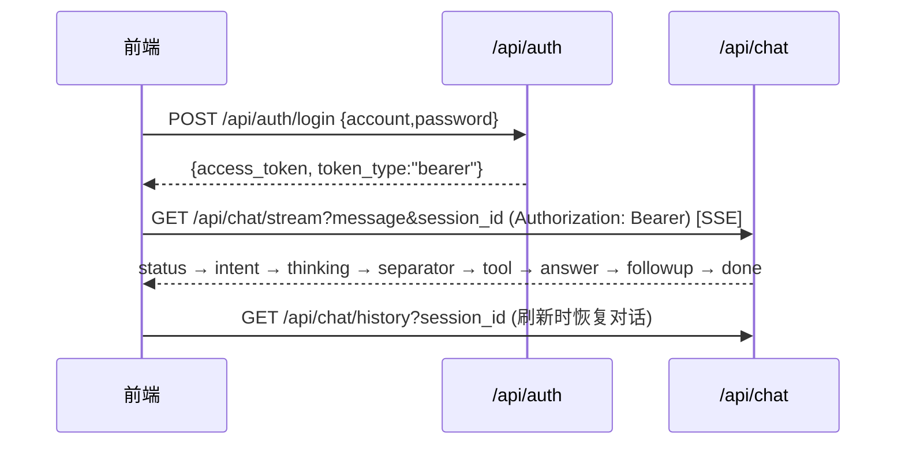

# API 文档（AI 智能客服 + 小说解构知识图谱系统）

本文档描述系统的全部 HTTP 接口。系统基于 FastAPI + SSE 构建，覆盖两个子系统：**① 基础子系统**——用户认证、多会话问答（RAG）、知识库管理与 AI 回答反馈（§3-§8，路径 `/api/auth`、`/api/chat`、`/api/sessions`、`/api/documents` 等）；**② 解构子系统**——小说解构任务、SSE 进度流、结构化浏览、Knowledge API 时态查询、人工复核（§9，路径 `/api/novel/*`）。接口清单与后端代码 `backend/src/routers/*.py` 逐一对应，文中所有请求/响应示例均可直接对照实际运行验证。为便于阅读理解，每个接口均独立说明其用途、请求方式、字段含义、响应结构与错误场景，不依赖跨章节跳转。

---

## 1. 概述

### 1.1 Base URL

本系统前后端分离部署。后端服务监听 `8000` 端口，所有接口统一挂载在 `/api` 前缀下；本地开发直接访问 `http://localhost:8000/api`，生产环境经 nginx 反向代理保留 `/api` 前缀。前端通过 Vite 开发代理把 `/api` 请求转发到后端，因此前端代码中无需拼接完整域名。

### 1.2 数据格式

- 除文件上传与流式问答外，所有接口的请求体和响应体均为 **JSON**（UTF-8 编码），请求时需在请求头携带 `Content-Type: application/json`。
- 文件上传（知识库上传接口）使用 **`multipart/form-data`** 表单，浏览器会自动生成 multipart 边界，无需手动指定 Content-Type。
- 问答接口使用 **SSE（Server-Sent Events）** 流式返回：响应头 `Content-Type: text/event-stream`，正文由多个以空行分隔的 `data:` 帧组成，前端可逐帧读取并逐字渲染，实现"边生成边显示"，而不是等待整段回答生成完毕。

### 1.3 认证方式

系统采用 **JWT（Bearer Token）** 认证：

1. 客户端先调用 `POST /api/auth/login`，用账号密码换取访问令牌 `access_token`；
2. 前端把令牌保存在浏览器 `localStorage` 的 `token` 键下，避免每次刷新页面都要重新登录；
3. 调用受保护接口时，在请求头携带 `Authorization: Bearer <access_token>`。

带令牌的接口在未携带或令牌无效/过期时，统一返回 `401`，响应体为：

```json
{"detail": "未认证或认证已过期"}
```

前端收到 `401` 后应引导用户重新登录。注册（register）与健康检查（health）两个接口不需要认证。

### 1.4 会话（Session）概念说明

系统支持"一次会话一次独立 Session"。用户在前端点击"新建会话"时生成一个会话 key（如 `s1`），后续所有提问都用该 key 作为 `session_id` 参数；同一个会话的消息会按时间顺序归并到同一条"会话记录"里。后端在存储时会把 key 与用户 id 组合成内部键 `user_{用户id}_{key}` 以隔离不同用户，但对外接口只需传原始 key。历史会话列表与详情接口可让用户随时回到任意一次会话查看完整对话记录。

### 1.5 前端对接与 API 层

前端通过 `frontend/src/api/index.js` 统一封装后端接口，本节说明前端调用 API 的几个关键约定，前端开发者接入时直接遵循即可。

- **Base 地址**：`BASE = ''`（空串）。开发环境由 Vite 代理把 `/api` 转发到 `http://localhost:8000`（端口 5173，120 秒超时），前端代码不写死后端域名；生产环境前端与后端同源部署（nginx 反代 `/api`），同样走相对路径。
- **统一鉴权头**：`authHeaders()` 从 `localStorage` 读取 `token`，返回 `{ Authorization: Bearer <token> }`；所有受保护接口都经它注入令牌，后续认证方案变更只改这一处。
- **文件上传**：`uploadDocuments()` 构造 `FormData` 提交，**不手动设置 `Content-Type`**——浏览器会自动生成 `multipart/form-data` 边界（boundary），手动设置反而会破坏边界导致服务端解析失败。
- **删除接口响应**：`deleteBook()`/`deleteDocument()` 后端返回 **`204 No Content`**（无响应体），前端据此在请求成功后不解析 JSON，仅校验 `status` 非 `204` 时抛错。
- **旧接口迁移**：`/api/ingest/*`（files/upload/books）为历史接口、无鉴权，已废弃；当前前端全部走带 Bearer 的 `/api/documents/*`。
- **一致性提示**：`frontend/.env.example` 中定义了 `VITE_API_BASE`，但当前 `api/index.js` 并未消费它（走 Vite 代理 + 同源），该变量为遗留定义，勿依赖。

### 1.6 链路追踪（X-Request-Id）

每个请求（含 SSE 流）在响应头携带 `X-Request-Id`——HTTP 中间件从请求头提取或后端生成，注入全部日志并可回写响应头，用于跨"前端 → 后端 → 事件总线 → 图节点"定位一次完整请求（实现见《AI架构设计.md》§10）。

---

## 2. 接口总表

下表列出全部接口。其中标注 **deprecated** 的为历史遗留接口（爬虫类），新业务不建议使用；`/api/ingest/*` 已彻底废弃（前端已迁移到 `/api/documents`）。

| Method | Path | 认证 | 说明 |
|---|---|---|---|
| POST | /api/auth/register | — | 注册（手机号/邮箱 + 密码） |
| POST | /api/auth/login | — | 登录，返回 JWT |
| GET | /api/chat/stream | Bearer | 问答流式接口（SSE） |
| GET | /api/chat/history | Bearer | 读取指定会话的历史消息 |
| GET | /api/sessions | Bearer | 当前用户的历史会话列表 |
| GET | /api/sessions/{id}/messages | Bearer | 会话详情（该会话的完整对话记录） |
| POST | /api/messages/{msg_id}/feedback | Bearer | 对某条 AI 回答点赞/踩（可附文字） |
| POST | /api/documents/upload | Bearer | 上传文档（.txt/.md/.pdf）并异步入库 |
| GET | /api/documents | Bearer | 文档列表（可按书名过滤） |
| GET | /api/documents/books | Bearer | 书分组聚合列表（前端"书籍"菜单） |
| DELETE | /api/documents/books/{book_name} | Bearer | 按书删除（整组文档行 + 对应向量） |
| DELETE | /api/documents/{id} | Bearer | 删除单个文档（该行 + 对应向量） |
| GET | /api/health | — | 健康检查（部署/流水线依赖） |
| POST | /api/crawler/fetch | — | 单篇网页爬取（deprecated，可选） |
| POST | /api/crawler/batch | — | 批量网页爬取（deprecated，可选） |
| POST | /api/crawler/novel/chapters | — | 解析小说章节列表（deprecated，可选） |
| POST | /api/crawler/novel/crawl | — | 批量爬取小说章节（deprecated，可选） |
| GET | /api/novel/books/{book_id}/jobs | Bearer | 解构任务列表 |
| GET | /api/novel/jobs/{job_id} | Bearer | 任务详情（含章节状态） |
| GET | /api/novel/books/{book_id}/chapters | Bearer | 章节列表 |
| POST | /api/novel/books/{book_id}/deconstruct | Bearer | 一键解构（202 新 job） |
| POST | /api/novel/jobs/{job_id}/retry | Bearer | 重试失败章 |
| GET | /api/novel/jobs/{job_id}/stream | Bearer | 解构进度 SSE 流 |
| GET | /api/novel/books/{book_id}/query | Bearer | 按实体/章节查询解构结果 |
| GET | /api/novel/books/{book_id}/browse/{type} | Bearer | 知识库浏览（10 类，分页+筛选） |
| GET | /api/novel/books/{book_id}/knowledge/graph | Bearer | 知识图谱 1-hop（时态 as-of N） |
| GET | /api/novel/books/{book_id}/knowledge/entities/{entity_id} | Bearer | 实体卡（时态 as-of N） |
| GET | /api/novel/books/{book_id}/knowledge/timeline | Bearer | 时间线事件（章节区间） |
| GET | /api/novel/books/{book_id}/knowledge/entities/{entity_id}/evidence | Bearer | 实体原文证据窗口 |
| GET | /api/novel/books/{book_id}/knowledge/entities/{entity_id}/snapshots | Bearer | 实体快照演化 |
| GET | /api/novel/books/{book_id}/validation | Bearer | 复核待办列表 + 汇总 |
| POST | /api/novel/validation/{issue_id}/confirm | Bearer | 裁决通过（confirmed） |
| POST | /api/novel/validation/{issue_id}/ignore | Bearer | 裁决忽略（ignored） |
| POST | /api/novel/validation/{issue_id}/fix | Bearer | 修正重写（fixed） |
| POST | /api/novel/books/{book_id}/validation/repersist | Bearer | 批量 re-persist |
| GET | /api/novel/books/{book_id}/validation/{issue_id}/evidence | Bearer | 疑点原文证据（复核分屏） |
| POST | /api/novel/books/{book_id}/validation/confirm | Bearer | 批量确认疑点 |

---

## 3. 认证接口

### 3.1 POST /api/auth/register — 用户注册

**用途**：创建新用户账号。注册成功后系统返回用户基本信息，后续即可用该账号登录获取令牌。`phone`（手机号）与 `email`（邮箱）两者**至少提供一个**，均用于登录时的账号识别；`password` 由后端用 bcrypt 哈希存储，不保存明文。

**请求示例**

```bash
curl -s -X POST http://localhost:8000/api/auth/register \
  -H 'Content-Type: application/json' \
  -d '{"phone":"13800138000","password":"test123456"}'
```

**请求体字段**

| 字段 | 类型 | 必填 | 说明 |
|---|---|---|---|
| phone | string | 二选一 | 手机号，≤20 位，须匹配 `^1\d{10}$`（大陆 11 位手机号） |
| email | string | 二选一 | 邮箱，≤100 位，须为合法邮箱格式 |
| password | string | 是 | 登录密码，6-64 位 |

**成功响应（HTTP 201）**：返回新用户的完整信息。

```json
{"id": 1, "phone": "13800138000", "email": null, "created_at": "2026-08-04T18:00:00"}
```

各字段含义：`id` 为用户唯一 id（后续 JWT 中的 `sub`）；`phone`/`email` 为用户注册的身份标识，未填写的一项为 `null`；`created_at` 为用户创建时间。

**错误场景**：

- `400`：手机号或邮箱格式不正确；或该手机号/邮箱已被注册（响应体 `{"detail":"手机号或邮箱已存在"}`）；或两者都未填写。
- `503`：数据库连接失败（响应体 `{"detail":"数据库连接失败，请稍后重试"}`），属服务端临时故障，可稍后重试。

### 3.2 POST /api/auth/login — 登录

**用途**：用已注册的账号登录，换取访问令牌。成功后可携带令牌调用问答、会话、知识库等受保护接口。

**请求示例**

```bash
curl -s -X POST http://localhost:8000/api/auth/login \
  -H 'Content-Type: application/json' \
  -d '{"account":"13800138000","password":"test123456"}'
```

**请求体字段**：`account`（string，1-100 位，手机号或邮箱，用于定位用户）；`password`（string，1-64 位）。

**成功响应（HTTP 200）**：

```json
{"access_token": "eyJhbGciOiJIUzI1NiIsInR5cCI6IkpXVCJ9...", "token_type": "bearer"}
```

`access_token` 为 JWT 令牌（默认 24 小时有效，时长由环境变量 `JWT_EXPIRE_MINUTES` 配置），后续请求放在 `Authorization: Bearer <access_token>` 头中；`token_type` 固定为 `bearer`。

**错误场景**：`401` 表示账号不存在或密码错误（响应体 `{"detail":"账号或密码错误"}`）；`503` 表示数据库不可达。

---

## 4. 对话接口

### 4.1 GET /api/chat/stream — 问答流式（SSE）

**用途**：本系统的核心 RAG 问答接口。用户传入问题，后端执行"校验 → 意图识别 → 用户输入优化 → 知识库向量检索 → 拼接 Prompt → 调用 LLM → 流式返回 → 落库"，并以 SSE 逐帧把结果推给前端。前端据此实现逐字显示、引用来源展示、意图标签与追问建议。

**请求示例**

```bash
curl -sN "http://localhost:8000/api/chat/stream?message=退换货政策是什么&session_id=s1&use_rag=true" \
  -H "Authorization: Bearer <token>"
```

**查询参数**

| 参数 | 类型 | 必填 | 说明 |
|---|---|---|---|
| message | string | 是 | 用户问题，长度 ≤500 字，超长会被拒绝 |
| session_id | string | 是 | 会话 key（前端"新建会话"时生成，同一会话复用同一个 key） |
| use_rag | bool | 否 | 是否使用知识库，默认 `true`。设为 `false` 时禁用知识库检索，由模型基于自身知识作答，回答会带免责标注 |

**校验顺序与错误**：接口按以下顺序校验，任一不通过立即返回错误响应（非流式）：
1. **401**：未携带或令牌无效 → `{"detail":"未认证或认证已过期"}`；
2. **400**：`message` 超过 500 字 → `{"detail":"提问内容过长，单次最多 500 字"}`；`session_id` 为空 → `{"detail":"session_id 不能为空"}`；
3. **429**：该用户当日提问次数达到上限（默认 100，环境变量 `DAILY_QUOTA` 配置）→ `{"detail":"今日提问次数已达上限"}`。

**成功响应（HTTP 200，SSE 流）**：响应为 `text/event-stream`，正文由若干 `data: {JSON}\n\n` 帧组成。后端共下发 **9 种事件**，前端按 `type` 字段分派处理。各事件说明如下：

| 事件 type | 载荷结构 | 含义与前端处理 |
|---|---|---|
| `status` | `{"type":"status","content":"正在理解您的问题..."}` | 流水线进度提示。系统在"理解→优化→检索→生成→降级"各阶段切换时发送，`content` 为当前阶段的中文提示。前端用它替换"思考中"加载点，让用户看到系统正在进行哪一步。 |
| `intent` | `{"type":"intent","intent":"售后问题","message_id":1}` | 意图识别结果，在 `status` 之后、首轮 LLM 之前发送。`intent` 取值：`产品咨询`/`售后问题`/`闲聊`/`投诉`/`其他`；`message_id` 为该条用户消息在数据库中的 id。前端据此给刚发送的用户消息打上意图标签。 |
| `thinking` | `{"type":"thinking","content":"用户询问退换货政策…"}` | LLM 首轮推理的思考过程（DeepSeek 的 reasoning_content），前端以斜体灰色样式展示。 |
| `separator` | `{"type":"separator"}` | 分隔线事件，标志思考阶段结束、正式回答开始，前端显示"─── 回答 ───"。 |
| `tool` | `{"type":"tool","content":"🔧 正在检索知识库..."}` | 工具调用提示。系统调用 `RAG_search_by_query` 检索知识库时发送。 |
| `answer` | `{"type":"answer","content":"您好，根据知识库…","source_refs":[...],"knowledge_mode":"model"?}` | 正式回答正文的分片。流式过程中该事件会持续多次，前端把各分片拼接到同一段回答里。首个分片携带 `source_refs`（引用来源数组，结构见下）与可选的 `knowledge_mode`；`knowledge_mode:"model"` 表示知识库未命中、由模型自身知识作答，前端需显示"💡 非知识库信息，仅供参考"免责标注。 |
| `followup` | `{"type":"followup","suggestions":["退货需要什么条件？","退款多久到账？"]}` | 追问建议。回答结束后 LLM 生成的 2-3 条用户可能继续问的短问题，在 `answer` 之后、`done` 之前发送。前端渲染为可点击按钮，点击后把该建议作为新消息发送到当前会话。 |
| `done` | `{"type":"done","message_id":2}` | 流结束事件，一定是最后一个事件。`message_id` 为本次 AI 回答落库后的消息 id，前端用它定位该回答以支持点赞/踩反馈；异常或未落库时为 `null`。 |
| `error` | `{"type":"error","content":"检索或回答过程出现异常，请稍后重试","error_code":"TOOL_EXEC_ERROR"}` | 异常事件。`error_code` 取值 `LLM_ERROR`（LLM 调用异常）或 `TOOL_EXEC_ERROR`（工具执行异常）。出现后同样会下发 `done` 收尾。 |

**`source_refs` 引用来源结构**：数组中每项代表一条知识库引用，包含三个字段——`book_name`（所属书籍/知识库分组名）、`file_name`（命中的文档文件名）、`chunk_id`（命中的知识片段唯一 id，用于前端按片段去重）。示例：

```json
"source_refs": [{"book_name": "客服知识库", "file_name": "售后政策.txt", "chunk_id": "售后政策_ch1_0000abc"}]
```

**完整事件序列示例（正常命中知识库）**：

```text
data: {"type":"status","content":"正在理解您的问题..."}
data: {"type":"intent","intent":"售后问题","message_id":1}
data: {"type":"status","content":"正在检索知识库（可能需要几秒）..."}
data: {"type":"thinking","content":"用户询问退换货政策…"}
data: {"type":"separator"}
data: {"type":"tool","content":"🔧 正在检索知识库..."}
data: {"type":"answer","content":"您好，根据知识库，本店支持7天无理由退货…","source_refs":[{"book_name":"客服知识库","file_name":"售后政策.txt","chunk_id":"售后政策_ch1_0000abc"}]}
data: {"type":"followup","suggestions":["退货需要什么条件？","退款多久到账？","运费由谁承担？"]}
data: {"type":"done","message_id":2}
```

**事件序列示例（空检索 → 模型知识降级）**：当知识库未命中时，后端跳过 `thinking`/`tool`，改为发送 `status("知识库未命中，正在基于模型知识回答...")`，随后下发带 `knowledge_mode:"model"` 与空 `source_refs` 的 `answer`，最后照常 `followup` + `done`。

### 4.2 GET /api/chat/history — 读取会话历史

**用途**：读取指定会话的完整历史消息，供前端切换会话或刷新页面后恢复对话。该接口**只查不建**：会话不存在时返回空数组，不会创建新会话。

**请求示例**

```bash
curl -s "http://localhost:8000/api/chat/history?session_id=s1" -H "Authorization: Bearer <token>"
```

**查询参数**：`session_id`（string，必填，会话 key）。

**成功响应（HTTP 200）**：返回消息对象数组，按时间升序排列。

```json
[
  {"role": "user", "content": "退换货政策是什么", "id": 1, "source_refs": [], "feedback": null, "feedback_text": null, "intent": "售后问题"},
  {"role": "ai", "content": "您好，根据知识库，本店支持7天无理由退货…", "id": 2, "source_refs": [{"book_name": "客服知识库", "file_name": "售后政策.txt", "chunk_id": "售后政策_ch1_0000abc"}], "feedback": null, "feedback_text": null, "intent": null}
]
```

**消息对象字段含义**：

| 字段 | 类型 | 说明 |
|---|---|---|
| role | string | 消息角色：`"user"` 为用户消息，`"ai"` 为 AI 回答 |
| content | string | 消息正文 |
| id | int | 消息在数据库中的唯一 id（反馈接口按此 id 定位消息） |
| source_refs | array | AI 回答的引用来源数组，每项含 `book_name`（书籍/知识库分组名）、`file_name`（命中的文档文件名）、`chunk_id`（命中的知识片段唯一 id）；用户消息为空数组 |
| feedback | string/null | 该消息的反馈状态：`"up"` 点赞、`"down"` 踩、`null` 未反馈 |
| feedback_text | string/null | 可选文字反馈内容，未填写为 `null` |
| intent | string/null | 用户消息的意图分类（`产品咨询`/`售后问题`/`闲聊`/`投诉`/`其他`）；AI 消息恒为 `null` |

**错误场景**：`400`（`session_id` 为空，`{"detail":"session_id 不能为空"}`）。

---

## 5. 会话接口

### 5.1 GET /api/sessions — 历史会话列表

**用途**：返回当前用户的所有历史会话，前端据此渲染左侧"会话列表"侧栏。会话按创建时间倒序排列（最新的在最上面）。

**请求示例**

```bash
curl -s "http://localhost:8000/api/sessions" -H "Authorization: Bearer <token>"
```

**成功响应（HTTP 200）**：

```json
[
  {"id": 5, "title": "退换货政策咨询", "created_at": "2026-08-04T18:00:00", "key": "s1"},
  {"id": 4, "title": "新会话", "created_at": "2026-08-04T17:00:00", "key": "s0"}
]
```

**字段含义**：`id` 为会话 id（会话详情接口按此 id 查询）；`title` 为会话标题——首个用户消息发送后系统自动取消息前 20 字命名，尚未有消息的会话为 `"新会话"`；`created_at` 为创建时间；`key` 为会话 key（与 `chat/stream` 的 `session_id` 一致，用于发起会话）。

**错误场景**：`503`（数据库不可达）。

### 5.2 GET /api/sessions/{id}/messages — 会话详情

**用途**：读取某个会话的完整对话记录。前端点击左侧会话列表中的某一项时调用此接口，加载该会话的全部历史消息。

**请求示例**

```bash
curl -s "http://localhost:8000/api/sessions/5/messages" -H "Authorization: Bearer <token>"
```

**路径参数**：`id`（int，会话 id，取自会话列表接口的 `id` 字段）。

**成功响应（HTTP 200）**：返回该会话的消息对象数组（按时间升序），每项结构如下；空会话返回 `[]`。

```json
[
  {"role": "user", "content": "退换货政策是什么", "id": 1, "source_refs": [], "feedback": null, "feedback_text": null, "intent": "售后问题"},
  {"role": "ai", "content": "您好，根据知识库，本店支持7天无理由退货…", "id": 2, "source_refs": [{"book_name": "客服知识库", "file_name": "售后政策.txt", "chunk_id": "售后政策_ch1_0000abc"}], "feedback": "up", "feedback_text": "回答有用", "intent": null}
]
```

**消息对象字段含义**：

| 字段 | 类型 | 说明 |
|---|---|---|
| role | string | 消息角色：`"user"` 为用户消息，`"ai"` 为 AI 回答 |
| content | string | 消息正文 |
| id | int | 消息在数据库中的唯一 id（反馈接口按此 id 定位消息） |
| source_refs | array | AI 回答的引用来源数组，每项含 `book_name`（书籍分组名）/`file_name`（文档文件名）/`chunk_id`（知识片段 id）；用户消息为空数组 |
| feedback | string/null | 该消息的反馈状态：`"up"` 点赞、`"down"` 踩、`null` 未反馈 |
| feedback_text | string/null | 可选文字反馈内容，未填写为 `null` |
| intent | string/null | 用户消息的意图分类（`产品咨询`/`售后问题`/`闲聊`/`投诉`/`其他`）；AI 消息恒为 `null` |

**错误场景**：

- `404`：会话不存在（`{"detail":"会话不存在"}`）；
- `403`：会话属于其他用户，无权访问（`{"detail":"无权访问该会话"}`）。接口按 `sessions.user_id` 校验归属，防止越权读取他人会话。

### 5.3 POST /api/messages/{msg_id}/feedback — 消息反馈

**用途**：对某条 AI 回答进行点赞/踩，并可附加一段文字说明（如指出哪里答错了）。重复提交会覆盖之前的反馈。

**请求示例**

```bash
curl -s -X POST http://localhost:8000/api/messages/2/feedback \
  -H "Authorization: Bearer <token>" -H 'Content-Type: application/json' \
  -d '{"feedback":"up","feedback_text":"回答有用"}'
```

**路径参数**：`msg_id`（int，消息 id，取自历史/详情接口的 `id` 字段）。

**请求体字段**：`feedback`（string，必填，取值 `"up"` 点赞或 `"down"` 踩）；`feedback_text`（string，可选，≤500 字）。

**成功响应（HTTP 200）**：返回更新后的反馈状态。

```json
{"id": 2, "feedback": "up", "feedback_text": "回答有用"}
```

**错误场景**（按校验顺序）：
- `401`：未认证；
- `404`：消息不存在（`{"detail":"消息不存在"}`）；
- `403`：消息属于其他用户，无权操作（`{"detail":"无权操作该消息"}`）；
- `400`：`feedback` 取值非法（非 `up`/`down`）或 `feedback_text` 超过 500 字；
- `503`：数据库不可达。

---

## 6. 知识库接口

### 6.1 POST /api/documents/upload — 上传文档

**用途**：上传知识库文档并异步完成向量化入库。系统先为每个文件建立一条 `processing`（处理中）状态的文档记录，随后在后台执行"解析 → 分块 → 向量化 → 去重 → 写入 Milvus"，完成后把状态更新为 `ready`（就绪）；若加载/向量化失败则更新为 `failed`（失败）。前端可通过文档列表接口轮询状态。

**请求示例**

```bash
curl -s -X POST http://localhost:8000/api/documents/upload \
  -H "Authorization: Bearer <token>" \
  -F "book_name=客服知识库" -F "files=@售后政策.txt" -F "files=@产品介绍.md"
```

**表单字段**：`book_name`（string，必填，书名/知识库分组键，同名的多个文件会归入同一本书共享一个 `book_id`）；`files[]`（必填，一个或多个文件，仅支持 `.txt`/`.md`/`.pdf`，且文件不能为空）。

**成功响应（HTTP 200）**：文档已受理，正在异步处理。

```json
{"id": 384, "book_id": "doc_1_384", "status": "processing", "file_names": ["售后政策.txt", "产品介绍.md"]}
```

**字段含义**：`id` 为该书首个文件的文档 id（即该书组 id）；`book_id` 为书籍分组稳定标识，格式 `doc_{用户id}_{文档id}`，是知识库向量与文档行关联的桥梁；`status` 固定为 `processing`；`file_names` 为本次上传的全部文件名。

**错误场景**：`400`——`book_name` 为空、未上传任何文件、文件类型不在 `.txt/.md/.pdf`、或文件内容为空。

### 6.2 GET /api/documents — 文档列表

**用途**：返回当前用户的文档列表（文件级，一行代表一个文件），按上传时间倒序。可通过 `book_name` 参数只查某本书下的文档，前端"文档"列表面板依赖此接口。

**请求示例**

```bash
curl -s "http://localhost:8000/api/documents?book_name=客服知识库" -H "Authorization: Bearer <token>"
```

**查询参数**：`book_name`（string，可选，过滤某本书）。

**成功响应（HTTP 200）**：

```json
[
  {"id": 384, "book_name": "客服知识库", "file_name": "售后政策.txt", "file_type": ".txt",
   "status": "ready", "chunk_count": 7, "milvus_collection": "content", "uploaded_at": "2026-08-04T18:00:00"}
]
```

**字段含义**：`id` 文档 id；`book_name` 所属书籍分组名；`file_name` 文件名；`file_type` 扩展名；`status` 入库状态（`processing` 处理中 / `ready` 就绪 / `failed` 失败）；`chunk_count` 该文件切分出的知识片段数（就绪后回填）；`milvus_collection` 向量集合 key（默认 `content`）；`uploaded_at` 上传时间。

### 6.3 GET /api/documents/books — 书分组聚合列表

**用途**：按书分组聚合统计，返回每本书的文档数与总片段数，前端左侧"书籍"菜单据此展示（如"客服知识库 · 3 文件 · 25 Chunk"）。

**成功响应（HTTP 200）**：

```json
[
  {"book_name": "客服知识库", "doc_count": 3, "chunk_total": 25, "uploaded_at": "2026-08-04T18:00:00"}
]
```

**字段含义**：`book_name` 书名；`doc_count` 该书下的文档文件数；`chunk_total` 该书全部文件的知识片段数总和；`uploaded_at` 该书最近一次上传时间。

### 6.4 DELETE /api/documents/books/{book_name} — 按书删除

**用途**：删除整本书：先删除该 `book_id` 在 Milvus 中的全部向量，再删除 MySQL 中该书分组内的所有文档行，保证数据库与向量库一致。接口幂等：书不存在或已删除时也返回 `204`。

**请求示例**

```bash
curl -s -X DELETE "http://localhost:8000/api/documents/books/客服知识库" -H "Authorization: Bearer <token>"
```

**路径参数**：`book_name`（string，书名，需 URL 编码）。

**成功响应**：`204 No Content`（无响应体）。

**错误场景**：`500`（Milvus 向量删除失败——此时 MySQL 行保留，可稍后重试，避免出现"库记录已删但向量残留"的不一致）。

### 6.5 DELETE /api/documents/{id} — 单文件删除

**用途**：删除单个文档文件及其对应的向量（按 `book_id + file_name` 精确定位），用于清理误传或不再需要的文件。幂等：重复删除同一文件返回 `204`。

**请求示例**

```bash
curl -s -X DELETE "http://localhost:8000/api/documents/384" -H "Authorization: Bearer <token>"
```

**路径参数**：`id`（int，文档 id）。

**成功响应**：`204 No Content`。

**错误场景**：`404`（文档不存在或不属于当前用户）；`500`（向量删除失败，行保留可重试）。

---

## 7. 系统接口

### 7.1 GET /api/health — 健康检查

**用途**：探测后端服务是否存活，部署与流水线脚本依赖此接口判断服务就绪状态。

**请求示例**

```bash
curl -s http://localhost:8000/api/health
```

**成功响应（HTTP 200）**：`{"status": "ok"}`。

---

## 8. 爬虫接口（deprecated）

> 以下爬虫接口为历史遗留能力，**新业务不建议使用**；知识库相关的前端流程已全部迁移到 `/api/documents`。

| Method | Path | 入参 | 成功出参 | 说明 |
|---|---|---|---|---|
| POST | /api/crawler/fetch | `{url, mode="dynamic"\|"intercept", api_pattern="conapi.php", timeout=15}` | `{success, title, content, filename, content_length}` | 抓取单个网页，`mode=dynamic` 用 Playwright 渲染 JS，`mode=intercept` 拦截站点内容接口 |
| POST | /api/crawler/batch | `{urls[], mode, api_pattern, timeout}` | `{results[], total, success_count}` | 批量抓取，单个失败不影响其它 |
| POST | /api/crawler/novel/chapters | `{novel_url, timeout}` | `{success, total, chapters:[{title,url,type}]}` | 解析小说目录页章节列表；`type` 为 `chapter`（正文）/ `extra`（番外/公告） |
| POST | /api/crawler/novel/crawl | `{chapters[], base_url, timeout}` | `{results[], total, success_count}` | 按章节列表并发（20 并发）抓取正文 |

`mode`、`api_pattern`、`timeout` 均为可选，取默认值即可；响应中 `success` 为布尔值，单个 URL 抓取失败时 `success: false` 并附 `error` 信息，不中断批量任务。

---

## 9. 解构子系统接口（小说解构 / 知识图谱）

> 本节描述解构子系统的全部接口（路径前缀 `/api/novel`，与 `backend/src/routers/novel.py` 逐一对应）。全部接口需 Bearer 认证；每个涉及 `book_id` 的接口先做归属校验 `_require_book`（非本人 → `404 {"detail":"book 不存在或不属于当前用户"}`）。解构流水线机制见《AI架构设计.md》§17-§26。

### 9.0 总览

20 个端点分三族：

| 族 | 端点 | 说明 |
| --- | --- | --- |
| 任务与进度 | jobs / job / chapters / deconstruct / retry / stream | 定位任务、查看进度、一键解构、重试、SSE 进度流 |
| 查询与 Knowledge API | query / browse / knowledge/* | 结构化查询、10 类浏览、时态 as-of N 图谱/实体卡/时间线/证据/快照 |
| 人工复核 | validation + confirm/ignore/fix/repersist | 复核待办、裁决、批量确认、疑点原文证据 |

---

### 9.1 GET /api/novel/books/{book_id}/jobs — 解构任务列表

**用途**：返回该书的历史解构任务（最新在前），客户端据此定位上传自动创建的 job。

**路径参数**：`book_id`（string，`doc_{user_id}_{doc_id}`）。

**成功响应（HTTP 200）**：

```json
[
  {"job_id": "djob_xxx", "trigger_type": "upload", "status": "done",
   "total_chapters": 120, "done_chapters": 120, "failed_chapters": 0,
   "started_at": "2026-08-18T10:00:00", "finished_at": "2026-08-18T10:20:00"}
]
```

**错误场景**：`404`（book 不存在或不属于当前用户）。

### 9.2 GET /api/novel/jobs/{job_id} — 任务详情

**用途**：返回单个任务的完整信息，含每章解构状态（前端"解构任务"详情面板用）。

**路径参数**：`job_id`（string，`djob_{snowflake}`）。

**成功响应（HTTP 200）**：job 行 + `chapters` 数组（按章序）：

```json
{
  "job_id": "djob_xxx", "book_id": "doc_1_5", "trigger_type": "upload",
  "status": "done", "total_chapters": 120, "done_chapters": 120, "failed_chapters": 0,
  "chapters": [
    {"chapter_id": "nch_xxx", "chapter_index": 1, "chapter_title": "第一章",
     "status": "done", "scene_count": 3, "retry_count": 0, "shrink_level": 0, "error_msg": null}
  ]
}
```

`chapters[].status` 取值：`pending` / `processing` / `done` / `failed`。

**错误场景**：`404`（job 不存在 / book 不属于当前用户）。

### 9.3 GET /api/novel/books/{book_id}/chapters — 章节列表

**用途**：返回书内全部章节元数据（不含正文，`list_chapters` 刻意排除大对象 `chapter_text`），前端章节滑块 max/标题用。

**成功响应（HTTP 200）**：

```json
[
  {"chapter_id": "nch_xxx", "book_id": "doc_1_5", "book_name": "超神机械师",
   "file_name": "第一章.txt", "chapter_index": 1, "chapter_index_in_file": 0,
   "chapter_title": "第一章", "char_offset_start": 0, "char_offset_end": 5000, "scene_count": 3}
]
```

### 9.4 POST /api/novel/books/{book_id}/deconstruct — 一键解构

**用途**：对已有 `novel_chapter` 的书发起一次新的手动解构任务（后台 `run_job` 执行，接口立即返回）。

**请求体**：无。

**成功响应（HTTP 202）**：

```json
{"job_id": "djob_xxx", "book_id": "doc_1_5", "status": "pending", "total_chapters": 120}
```

**错误场景**（按顺序）：
- `404`：book 不属于当前用户；或 `{"detail":"该书无 novel_chapter（需先上传并 deconstruct=1）"}`；
- `409`：`{"detail":"该书已有 running job"}`（防并发双跑）。

### 9.5 POST /api/novel/jobs/{job_id}/retry — 重试失败章

**用途**：重跑指定（或缺省=全部）`failed` 章。请求体 `chapter_ids` 省略时重试全部失败章；传入数组则只重试指定章（先 `reset_chapters_to_pending` 再 run_job）。

**请求体**：

```json
{"chapter_ids": ["nch_xxx", "nch_yyy"]}   // 可选；省略 = 全部 failed 章
```

**成功响应（HTTP 200）**：`{"job_id": "djob_xxx", "retry_chapters": 3}`。

**错误场景**：`404`（job 不存在 / 非本人）；`409`（`job 运行中`，防并发双跑）。

### 9.6 GET /api/novel/jobs/{job_id}/stream — SSE 解构进度流

**用途**：订阅任务的实时解构进度。后端经 `events.py` 总线按 job_id 过滤实时事件，并每 1s 轮询 `deconstruct_job` 补发 `progress`；终态（done/failed）后断开。

**成功响应（HTTP 200，`text/event-stream`）**：正文为多个 `data: {JSON}\n\n` 帧。事件类型：

| 事件 type | 载荷示例 | 含义 |
| --- | --- | --- |
| `job_started` | `{"type":"job_started","job_id":"djob_x","book_id":"doc_1_5","trigger_type":"manual","total_chapters":120}` | 任务启动 |
| `chapter_started` | `{"type":"chapter_started","job_id":"djob_x","chapter_id":"nch_1","chapter_index":1,"chapter_title":"第一章","scene_count":3}` | 某章开始解构 |
| `scene_started` | `{"type":"scene_started","job_id":"djob_x","chapter_id":"nch_1","scene_index":0}` | 某场景开始抽取 |
| `agent_started` / `agent_done` / `agent_failed` | `{"type":"agent_done","job_id":"djob_x","chapter_id":"nch_1","agent":"entity","status":"ok","items":5}` | 8 个解构 Agent 的开始/完成/失败 |
| `chapter_done` / `chapter_failed` | `{"type":"chapter_done","job_id":"djob_x","chapter_id":"nch_1","status":"done"}` | 某章完成/失败 |
| `progress` | `{"type":"progress","job_id":"djob_x","done":60,"failed":1,"total":120}` | 轮询计数（每 1s） |
| `job_done` / `job_failed` | `{"type":"job_done","job_id":"djob_x","done_chapters":120,"failed_chapters":0}` | 任务终态 |

> 另存在无 `type` 的裸事件 `chapter_results`（LangGraph 归约产物），前端忽略。

> 事件由 `events.py` 进程内事件总线发布/订阅（`publish`/`subscribe`，按 job_id 过滤，见《AI架构设计.md》§25），SSE 生成器实时订阅、连接断开时退订。

### 9.7 GET /api/novel/books/{book_id}/query — 结构化查询

**用途**：按实体/章节查询解构结果（SQL 装配 11 表）。参数全部可选，按提供项返回对应字段。

**查询参数**：`entity`（string，实体名，提供则返回该实体的快照与关系）、`chapter`（int，快照按精确章过滤）、`chapter_start`/`chapter_end`（int，关系按起始章区间过滤）、`events`（bool，默认 false，true 时返回指定章的时间线事件）。

**成功响应（HTTP 200）**（按参数组合返回）：

```json
{
  "snapshots": [{"snapshot_id":"s_ent_1","entity_name":"韩立","entity_type":"human","status_desc":"…","attributes":{},"chapter_index":1}],
  "relations": [{"relation_id":"rel_x","source_name":"三叔","target_name":"韩立","relation_type":"family","relation_weight":1,"valid_period":"permanent","start_chapter":1,"end_chapter":0}],
  "events": [{"event_id":"ev_x","event_level":"event","parent_event_id":"ev_stage","event_title":"…","event_content":"…","time_desc":"…","global_sort":1,"start_chapter":1,"end_chapter":1,"involved_entities":["韩立","三叔"]}]
}
```

### 9.8 GET /api/novel/books/{book_id}/browse/{type} — 知识库浏览

**用途**：按类型分页 + 字段筛选/模糊查询该书的解构数据（前端"数据"tab 用）。`type` 10 类，各自带过滤参数，均经参数绑定防注入。

**路径参数**：`type` ∈ `entity` / `entity_snapshot` / `relation` / `timeline_event` / `location` / `foreshadowing` / `conflict` / `rule` / `alias` / `validation`。

**查询参数**（通用）：`limit`（默认 20，max 100）、`offset`（默认 0）；各类型的筛选字段见下表（`name`/`title` 用模糊 LIKE，枚举用精确 eq，`chapter_from`/`chapter_to` 用区间 ge/le）：

| type | 主要筛选参数 |
| --- | --- |
| entity | `name`、`entity_type`、`is_active` |
| entity_snapshot | `entity_name`、`entity_type`、`chapter_index` |
| relation | `entity_name`（source 或 target 模糊）、`relation_type`、`valid_period`、`chapter_from`、`chapter_to` |
| timeline_event | `event_level`、`title`、`chapter_from`、`chapter_to` |
| location | `name`、`location_level` |
| foreshadowing | `status`、`title` |
| conflict | `title`、`conflict_type`、`current_status` |
| rule | `name`、`rule_type` |
| alias | `alias_name`、`alias_type` |
| validation | `status`、`severity`、`issue_type` |

**成功响应（HTTP 200）**：`{"total": n, "items": [...]}`；relation 项含 `source_name`/`target_name`，validation 项含 `chapter_title`。

**错误场景**：`404`（未知浏览类型 `{"detail":"未知浏览类型: {type}"}`）。

---

### 9.9 GET /api/novel/books/{book_id}/knowledge/graph — 知识图谱 1-hop

**用途**：返回以 `entity_id` 为中心、**截至 chapter 章（as-of N）**的有效关系 1-hop 图（节点上限 100 / 边上限 100），前端"图谱"tab 渲染用。

**查询参数**：`entity_id`（string，必填，中心实体）、`chapter`（int，可选，缺省=该书最新章节）。

**成功响应（HTTP 200）**：

```json
{
  "chapter": 120,
  "center": {"entity_id":"ent_1","name":"韩立","type":"human"},
  "nodes": [{"entity_id":"ent_1","name":"韩立","type":"human"}, {"entity_id":"ent_2","name":"七玄门","type":"faction"}],
  "edges": [{"from":"ent_1","to":"ent_2","relation_type":"belong_to","weight":1}]
}
```

**错误场景**：`404`（实体不存在或不属于当前用户）。

### 9.10 GET /api/novel/books/{book_id}/knowledge/entities/{entity_id} — 实体卡

**用途**：返回实体卡（as-of N 时态聚合）：基础信息 + 别名 + 最新快照 + 有效关系 + 参与事件 + 原文证据 + confidence + **二阶段 L0-L4 五键**（身份锚点 / 静态基线 / 章节快照（含状态累积回填）/ 聚合弧光 / 叙事功能·明暗·规则）。

**查询参数**：`chapter`（int，可选，缺省=最新章节）。

**成功响应（HTTP 200）**：

```json
{
  "entity_id": "ent_1", "name": "韩立", "type": "human",
  "aliases": ["二愣子", "韩立"],
  "status": {"chapter_index": 120, "status_desc": "筑基后期，凝液期", "attributes": {}},
  "relations": [
    {"other_entity_id":"ent_2","other_name":"七玄门","relation_type":"belong_to","weight":1,
     "valid_period":"temporary","start_chapter":1,"end_chapter":0}
  ],
  "events": [{"event_id":"ev_x","event_title":"拜入七玄门","event_level":"event","global_sort":1,"start_chapter":1,"end_chapter":1}],
  "evidence": {"chapter_index":120,"chapter_title":"第一百二十章","text":"…±200 字窗口…","char_start":100,"char_end":500},
  "confidence": 0.9, "review_status": "confirmed",

  "L0_identity": {"narrative_role":"主角","arc_type":"成长型","first_chapter":1,"last_chapter":120,
                  "is_active":true,"aliases_by_type":{"nickname":["二愣子"],"full_name":["韩立"]}},
  "L1_baseline": {"origin":"出身农户，赴七玄门求仙",
                  "core_baseline":{"desire":"长生","fear":"死亡","obsession":"宁折不弯"},
                  "personality":"…","memory_points":[],"three_state":"inference"},
  "L2_snapshot": {"chapter_index":120,"status_desc":"筑基后期","attributes":{…固定键…},
                  "three_state":"fact","confidence":0.9,"review_status":"confirmed"},
  "L3_arc": {"snapshots":[…全量…],"events":[…履历…],
             "relation_evolution":[{"other_name":"七玄门","relation_type":"belong_to","start_chapter":1,
                                    "end_chapter":0,"surface_relation":"外门弟子","inner_relation":"","relation_trend":"稳定"}],
             "foreshadowing_line":[{"title":"修仙之路","setup_chapter":1,"reveal_chapter":null,"status":"pending"}]},
  "L4_narrative": {"unresolved_secrets":[{"title":"修仙之路","foreshadowing_type":"剧情","concealment_level":5,
                                          "misleading_info":"","three_state":"inference"}],
                   "rules":[{"rule_name":"元气限制","rule_type":"cap","rule_content":"…","subject_ability":"…","last_check_result":null}],
                   "conflicts":[{"conflict_title":"韩父取舍","current_status":"解决","side_a":"韩父","side_b":"韩父"}],
                   "surface_inner_relations":[{"other_name":"七玄门","relation_type":"belong_to","surface_relation":"外门弟子",
                                               "inner_relation":"","relation_trend":"稳定","three_state":"fact"}],
                   "narrative_types":[{"event_title":"拜入七玄门","narrative_type":"转折","plot_impact":"推动拜师线","three_state":"inference"}]}
}
```

`status` 为 as-of N **最近一条**快照（旧键）；`L2_snapshot` 为**状态累积回填**结果（逐属性最近非空，兜底增量提取省略）；`relations`/`events` 为 as-of N 有效关系/事件（旧键）；`L0-L4` 为二阶段叙事层（三态：fact/inference/review，主观字段 inference、待复核由 `review_status` 弱视觉表达）；`evidence` 为指定章含实体名/别名的原文窗口（未出现 → `null`）。

**错误场景**：`404`（实体不存在或不属于当前用户）。

### 9.11 GET /api/novel/books/{book_id}/knowledge/timeline — 时间线事件

**用途**：返回指定章节区间的时间线事件（缺省=全部），含 `involved_entities`（参与实体名列表）。

**查询参数**：`chapter_start`/`chapter_end`（int，可选，按 `start_chapter` 过滤）。

**成功响应（HTTP 200）**：`{"events": [{"event_id","event_level","parent_event_id","event_title","event_content","time_desc","global_sort","start_chapter","end_chapter","involved_entities":[...]}, ...]}`。

### 9.12 GET /api/novel/books/{book_id}/knowledge/entities/{entity_id}/evidence — 实体原文证据

**用途**：返回指定章内含实体名/别名的原文窗口片段（±200 字），前端"查看原文"证据面板用。

**查询参数**：`chapter`（int，可选，缺省=最新章节）。

**成功响应（HTTP 200）**：证据对象（含 `chapter_index`/`chapter_title`/`text`/`char_start`/`char_end`）；未出现 → `{"evidence": null}`。

**错误场景**：`404`（实体不存在或不属于当前用户）。

### 9.13 GET /api/novel/books/{book_id}/knowledge/entities/{entity_id}/snapshots — 实体快照演化

**用途**：返回实体在章节区间的全部快照（按章序升序），前端"快照演化时间轴"+"出场热力图"用。

**查询参数**：`chapter_start`/`chapter_end`（int，可选，缺省=全部）。

**成功响应（HTTP 200）**：

```json
{"snapshots": [
  {"chapter_index": 1, "status_desc": "被应允参加七玄门考验", "attributes": {}, "confidence": 0.9, "review_status": "confirmed"},
  {"chapter_index": 120, "status_desc": "筑基后期", "attributes": {"境界":"筑基后期"}, "confidence": null, "review_status": null}
]}
```

**错误场景**：`404`（实体不存在或不属于当前用户）。

---

### 9.14 GET /api/novel/books/{book_id}/validation — 复核待办

**用途**：返回该书全部 `pending` 疑点列表 + 按 (issue_type, severity) 的汇总，前端"复核"tab 用。疑点项附带目标行 `confidence`（供排序/展示）。

**成功响应（HTTP 200）**：

```json
{
  "pending": [
    {"issue_id":"vis_x","book_id":"doc_1_5","chapter_id":"nch_1","chapter_title":"第一章",
     "record_type":"entity_relation","issue_type":"semantic_conflict","severity":"warning",
     "status":"pending","description":"…","original_value":"…","suggested_value":"…","confidence":0.6}
  ],
  "summary": {"pending_total": 3, "by_type_severity": [{"issue_type":"semantic_conflict","severity":"warning","n":2}]}
}
```

### 9.15 POST /api/novel/validation/{issue_id}/confirm — 裁决通过

**用途**：人工确认疑点为真 → `pending → confirmed`，并同事务写回目标知识行（`review_status=confirmed` + `confidence=1.0`）；确认是 re-persist 的前置。

**成功响应（HTTP 200）**：`{"issue_id": "vis_x", "status": "confirmed"}`。

**错误场景**：`409`（`{"detail":"非法迁移：仅 pending 可 confirm"}`）。

### 9.16 POST /api/novel/validation/{issue_id}/ignore — 裁决忽略

**用途**：人工忽略（误报）→ `pending/confirmed → ignored`，写回 `review_status=ignored`。

**成功响应（HTTP 200）**：`{"issue_id": "vis_x", "status": "ignored"}`。

**错误场景**：`409`（`{"detail":"非法迁移：仅 pending/confirmed 可 ignore"}`）。

### 9.17 POST /api/novel/validation/{issue_id}/fix — 修正重写

**用途**：人工修正 → 记录 `corrected_value`（审计）→ re-persist → `fixed`，写回 `review_status=fixed` + `confidence=1.0`。

**请求体**：`{"corrected_value": "修正后的 JSON 字符串"}`（可选，缺省用 `suggested_value`）。

**成功响应（HTTP 200）**：`{"issue_id": "vis_x", "status": "fixed"}`。

**错误场景**：`409`（`{"detail":"re-persist 失败（pending 状态/非法修正值）"}`）。

### 9.18 POST /api/novel/books/{book_id}/validation/repersist — 批量 re-persist

**用途**：对人工勾选的多条疑点批量执行 re-persist（先确认再重写回目标表）。

**请求体**：`{"issue_ids": ["vis_x", "vis_y"]}`。

**成功响应（HTTP 200）**：`{"total": 2, "succeeded": 2}`（`repersist_book` 逐条静默计数）。

### 9.19 GET /api/novel/books/{book_id}/validation/{issue_id}/evidence — 疑点原文证据

**用途**：返回疑点对应章节的真实原文窗口（±200 字）+ 命中关键词，前端"复核左右分屏"的左侧原文用。关键词来源 = `description` 明文 + `suggested_value`/`original_value` 的 JSON 字符串叶值（长词优先）。

**成功响应（HTTP 200）**：证据对象（含 `chapter_index`/`chapter_title`/`text`/`char_start`/`char_end`/`matched_terms`）；无证据 → `{"evidence": null}`。

**错误场景**：`404`（疑点不存在或不属于当前用户）。

### 9.20 POST /api/novel/books/{book_id}/validation/confirm — 批量确认疑点

**用途**：对多条疑点一键确认（低风险批量）：逐条校验归属（非本人 → failed 跳过，不越权）、非 pending（已裁决）→ failed；其余 confirm + 同事务写回。单事务统一 commit。

**请求体**：`{"issue_ids": ["vis_x", "vis_y"]}`。

**成功响应（HTTP 200）**：

```json
{"total": 3, "succeeded": 2, "failed": ["vis_z"]}
```

---

## 10. 业务规则在接口层的实现

本节说明几个贯穿多个接口的业务规则在代码中的具体实现，帮助调用方理解接口的"隐藏行为"（何时会触发、为何这样设计）。

### 9.1 每日限流（429）

`GET /api/chat/stream` 在接收提问前调用限流校验：按"当前用户 + 当日（MySQL `curdate()`）+ `role='user'` 消息数"统计该用户当天已提问次数，达到 `DAILY_QUOTA`（默认 100，环境变量可配）即返回 `429 {"detail":"今日提问次数已达上限"}`。统计使用**独立短生命周期数据库会话**（而非请求级会话），避免事务快照陈旧导致计数不准确。

### 9.2 会话懒创建

`sessions` 表的一行代表一次会话，但**会话行不是在"新建"时创建，而是在首次发送消息时自动创建**：前端"新建会话"只生成一个客户端 key，第一次调用 `chat/stream` 时后端按 `(user_id, key)` 查到没有则插入一行（`title="新会话"`）。并发同时创建同一会话时，靠 `(user_id, key)` 唯一约束 + 冲突回滚重查保证只落一行。

### 9.3 历史只查不建

`GET /api/chat/history` 与 `GET /api/sessions/{id}/messages` 都是**只读**接口：会话不存在时返回空数组 `[]`，**不会**触发创建会话行。因此"查看历史"与"发起会话"语义严格分离。

### 9.4 上传异步状态机

`POST /api/documents/upload` 是异步接口：后端先为每个文件建立 `status='processing'`（处理中）的文档行并立即返回"已受理"；随后在后台任务里执行"解析→分块→向量化→去重→写入 Milvus"，完成后把状态更新为 `ready`（就绪）并回填 `chunk_count`（该文件的知识片段数），失败则置为 `failed`。前端通过 `GET /api/documents` 轮询状态。

### 9.5 删除双一致性

`DELETE /api/documents/books/{book_name}` 与 `DELETE /api/documents/{id}` 采用**先删向量、后删行**的顺序：先删 Milvus 中该书/该文件对应的向量，成功后再删 MySQL 文档行；若向量删除失败，接口返回 `500` 且 **MySQL 行保留**，供调用方稍后重试，避免"库记录已删但向量残留"的不一致。

### 9.6 反馈覆盖（幂等写）

`POST /api/messages/{id}/feedback` 对同一条消息重复提交会**覆盖**旧值（如先 `up` 再 `down`，最终为 `down`），不会报错——这是幂等写，前端可放心重试。

---

## 11. 错误码总表

下表汇总全系统统一使用的 HTTP 状态码与触发场景，便于前端统一做错误提示。

| HTTP | 名称 | 触发场景与说明 |
|---|---|---|
| 400 | 参数校验失败 | 注册格式错误/账号已存在；提问超过 500 字、`session_id` 为空；反馈值非法或文字超长；上传未选文件/类型不支持/文件为空。响应体 `detail` 字段给出具体原因 |
| 401 | 未认证 | 未携带或令牌无效/过期；登录时账号或密码错误。受保护接口统一 `{"detail":"未认证或认证已过期"}` |
| 403 | 越权 | 对他人消息做反馈（`无权操作该消息`）、读取他人会话（`无权访问该会话`）、删除他人文档 |
| 404 | 资源不存在 | 消息/会话/文档不存在或不属于当前用户；解构侧：`book 不存在或不属于当前用户`、`job 不存在`、`该书无 novel_chapter`、`实体/疑点不存在或不属于当前用户`、`未知浏览类型` |
| 409 | 冲突 | 解构侧：`该书已有 running job`（一键解构并发防双跑）、`job 运行中`（重试防并发双跑）、`非法迁移`（复核状态机 pending→非 pending 拒绝）、`re-persist 失败` |
| 429 | 限流 | 当日提问次数达到上限（默认 100），`{"detail":"今日提问次数已达上限"}` |
| 500 | 服务端错误 | 删除文档时向量库删除失败（MySQL 行保留，可重试） |
| 503 | 依赖不可用 | MySQL 数据库连接失败，`{"detail":"数据库连接失败，请稍后重试"}` |

### 10.1 错误响应统一结构

除上述状态码外，后端通过统一异常体系保证**错误响应体结构一致**：业务异常（`AppError`）返回 `{"detail": "...", "error_code": "..."}`——`detail` 为人类可读原因，`error_code` 为稳定机器码；未捕获的异常由全局兜底 handler 返回 `500` 并记录堆栈，**不向客户端泄漏内部细节**。请求体经 Pydantic 校验失败统一返回 **`422 Unprocessable Entity`**（含校验错误明细），与业务 `400` 区分开（`400` 表示业务规则不满足，`422` 表示请求体格式/字段校验不通过）。

### 10.2 错误码设计原则

| 错误码 | 含义 | 使用场景 |
|---|---|---|
| 400 | 参数/业务校验失败 | 注册格式错/已存在、提问超长、feedback 非法、上传类型不支持 |
| 401 | 未认证 | 未携带/无效令牌；登录账号密码错误 |
| 403 | 越权 | 操作他人消息/会话/文档 |
| 404 | 资源不存在 | 消息/会话/文档/解构任务/实体/疑点/浏览类型不存在 |
| 409 | 冲突 | 解构任务已 running（防并发双跑）；复核状态机非法迁移 |
| 422 | 请求体校验失败 | Pydantic 字段校验（与 400 区分） |
| 429 | 限流 | 当日提问达上限 |
| 500 | 服务端错误 | 向量删除失败（可重试） |
| 503 | 依赖不可用 | 数据库连接失败 |

### 10.3 幂等与并发安全小结

| 场景 | 保证方式 |
|---|---|
| 删除接口 | `DELETE` 幂等：重复删除不存在/已删除的资源返回 `204` |
| 反馈 | `feedback` 覆盖式写入，重复提交不报错 |
| 会话 | `(user_id, key)` 唯一约束，并发建会话只落一行 |
| 上传 | 同书跨批 append + `content_hash` 去重，重复内容不产生冗余向量 |
| 双删 | 先删向量后删行，向量失败返回 500、MySQL 行保留可重试 |

---

## 12. 附：认证与问答时序

以下时序图展示"登录 → 发起会话 → SSE 流式问答"的完整调用顺序：


