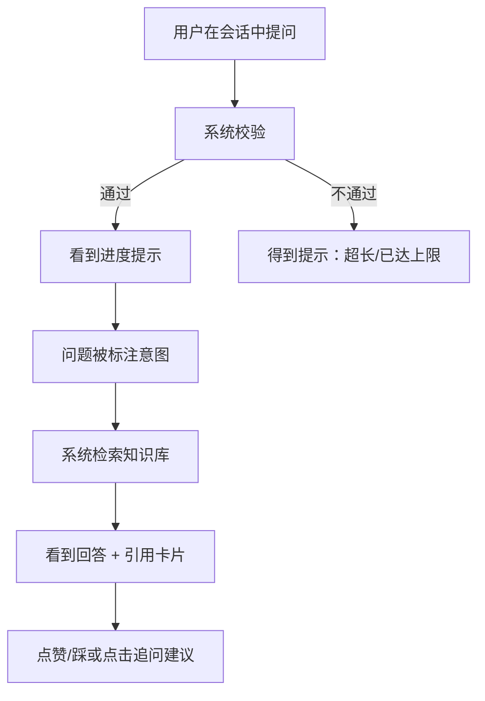

# 业务流程说明（AI 智能客服 + 小说解构知识图谱系统）

本文档从**用户/业务视角**描述系统的端到端流程。系统含**双子系统**：**① AI 智能客服 RAG**（§1-§5）——用户如何上传知识、如何与系统对话、如何反馈与追问、系统在异常情况下会给用户什么；**② 小说解构 / 知识图谱**（§6）——用户如何上传小说、触发解构、查看解构进度、浏览知识图谱与实体百科、人工复核解构产物。文中各节自成一体、可独立阅读；业务规则数值与实际代码一致（`backend/src/routers/*.py`）。

---

## 1. 概述

本文档关注"业务怎么流转、用户看到什么"，而非"系统内部怎么实现"（内部组件机制见《AI架构设计.md》）。系统有两条核心旅程：

**旅程一（客服问答）**：上传知识 → 与知识库对话 → 反馈与追问 → 持续管理知识库

- **上传知识**：把企业文档（产品说明、FAQ、售后政策等 .txt/.md/.pdf）放进知识库，系统自动解析并向量化，之后即可被问答检索到。
- **与知识库对话**：在任意会话中提问，系统检索知识库并给出带引用的回答；回答实时逐字输出。
- **反馈与追问**：对回答点赞/踩（可附文字）、点击系统给出的追问建议继续深挖。
- **管理知识库**：查看文档列表与入库状态、按书或按单个文件删除、追加新章节（增量更新）。

**旅程二（小说解构）**：上传小说 → 一键解构 → 查看解构进度 → 浏览知识图谱 / 实体百科 / 数据 → 人工复核

- **上传小说**：上传小说文件（.txt/.md，按章节切分入库），上传时可携带 `deconstruct=1` 自动发起解构。
- **一键解构**：在"解构工作台"（`/deconstruct`）对已有章节的书发起解构任务，系统用 9 个 AI Agent 逐章抽取实体/关系/时间线/伏笔/冲突/规则等知识。
- **查看进度**：解构任务有实时进度流（SSE），失败章节可单独重试。
- **浏览**：在"图谱 / 百科 / 数据"三个视图查看解构产物——关系图、实体卡、快照演化时间轴、结构化数据列表，可拖动章节滑块回放到任意剧情节点的当时状态。
- **人工复核**：解构过程中拦截的可疑项进入"复核"工作台，人工核对原文证据后裁决（通过 / 忽略 / 修正）。

---

## 2. 问答业务链路

### 2.1 业务链路图

### 2.2 分步说明（用户看到什么 / 系统返回什么）

1. **提问**：用户在输入框输入问题（单次 ≤500 字，超长会立即提示"提问内容过长，单次最多 500 字"）并发送。每个会话相互独立——每次"新建会话"都是一次独立对话，历史会话可在左侧列表随时切回。
2. **校验**：系统先检查登录态与输入；若当日提问已达上限（每日 100 次），会提示"今日提问次数已达上限"。
3. **进度提示**：发出后界面显示动态进度文字（"正在理解您的问题..."、"正在检索知识库（可能需要几秒）..."、"正在基于检索结果生成回答..."），让用户知道系统正在进行哪一步，而不是干等。
4. **意图标注**：问题旁出现意图徽标（如"售后问题"），标识系统对该问题的分类判断。
5. **回答 + 引用**：AI 回答以**逐字流式**方式出现（边生成边显示，不等待完整）；回答下方展示**引用卡片**——命中的知识来源（文档名 + 片段数），用户可展开核对回答依据。若知识库未命中而由模型自身知识作答，回答会带"💡 非知识库信息，仅供参考"免责标注。
6. **反馈与追问**：回答后可点赞/踩（可附文字）；回答下方还提供 2-3 条**可点击的追问建议**，点击即作为新问题继续追问。
7. **异常**：若回答过程中出现异常，界面给出友好错误提示；已完成的会话内容不受影响。

---

## 3. 知识库业务生命周期

### 3.1 上传 → 处理中 → 就绪 / 失败

用户上传文档（.txt/.md/.pdf，一个或多个文件）时需指定一个**书籍名称**（book_name）。上传后文档立即出现在列表中，状态为"处理中"；系统在后台完成解析、分块、向量化后，状态变为"就绪"并回填该文件的知识片段数（chunk 数）；若处理失败则显示"失败"，可删除后重新上传。

### 3.2 列表与按书管理

- **书分组**：左侧"书籍"列表按书名聚合，显示每本书的文件数与总片段数（如"客服知识库 · 3 文件 · 25 Chunk"）。
- **文档列表**：选中某本书后，右侧显示该书下每个文件的上传时间、状态与片段数，可单个删除或整书删除。

### 3.3 重复上传与增量更新

- **重复上传**：内容与已有文档完全相同的文件再次上传时，系统会跳过重复部分（按内容指纹去重），不会产生冗余向量；上传结果中该文件标记为"已存在，跳过"。
- **增量追加**：同一本书可多次上传——例如长篇小说按章节分批上传、企业白皮书按卷追加，新内容会追加到该书，不破坏已有向量。

### 3.4 删除的一致性体验

删除单个文件或整本书时，系统**先删除向量、后删除记录**：若向量删除失败，界面会提示"删除向量失败，请稍后重试"且记录保留，避免出现"记录已删但数据残留"的不一致。重复删除已不存在的文件/书也会正常成功（幂等）。

---

## 4. AI 工程问题的业务处理

本节说明系统在面对 AI 特有的工程问题时，用户实际会得到什么，以及为什么这样兜底。

### 4.1 空检索（知识库未命中）

当知识库检索不到相关内容时，系统**不会硬编一个答案**，而是分两步：

1. 先提示"知识库未命中，正在基于模型知识回答..."，改由模型基于自身知识作答，且答案带**"💡 非知识库信息，仅供参考"**免责标注——让用户清楚这不是企业官方资料。
2. 若模型也答不出，则返回兜底话术："抱歉，知识库中暂无相关信息。请尝试换个问法，或联系人工客服获取帮助。"

**为何这样兜底**：宁可明确告知"没有这个信息"并引导，也不把猜测包装成事实——这是"不编造答案"在业务层的体现。

### 4.2 上下文超长（多轮对话）

多轮对话中系统只携带**最近 10 条**消息参与当前回答，并设 3000 字上下文预算；超出时丢弃最旧的消息、始终保留当前提问。

**业务影响**：会话较长时，较早的对话不会被完整记住——这是刻意的取舍，保证单次回答的上下文不过载、成本可控。用户如需回溯，可在左侧会话列表查看完整历史。

### 4.3 幻觉治理（用户如何核对来源）

回答下方展示**引用卡片**（命中的文档与片段），用户可展开核对回答是否真有出处；引用只来自真实检索到的片段。配合"仅基于知识库回答、不编造"的约束与空检索兜底，用户在界面上能直观判断回答是否有据。

### 4.4 限流（每日提问上限）

每个用户每日最多提问 **100 次**（可配置）。超过后界面提示"今日提问次数已达上限"，次日恢复。这是防止单个用户过度占用服务资源的业务规则。

### 4.5 LLM 超时 / 异常

若回答生成过程中出现超时或异常，界面会给出友好提示（"检索或回答过程出现异常，请稍后重试"等），不会让页面卡死；已完成的会话与知识库数据不受影响，用户可稍后重试。

---

## 5. 用户侧能力清单（加分项）

### 5.1 意图识别

每条用户消息旁显示**意图徽标**，系统把问题分为五类：产品咨询 / 售后问题 / 闲聊 / 投诉 / 其他。用户一眼看到系统对问题的理解方向；该分类也会写入会话记录，刷新后仍可见。

### 5.2 追问引导

AI 回答结束后，下方自动生成 **2-3 条可点击的追问建议**（如"退货需要什么条件？""退款多久到账？"）。点击某条建议，它会作为新问题在当前会话中继续发送——方便用户沿着回答继续深入，不必重新组织问题。

### 5.3 会话管理

- **新建会话**：随时开启一次全新对话（每次独立 Session）。
- **历史会话**：左侧列表展示过往会话（标题为首条消息自动命名），点击即可查看完整对话记录。
- **反馈**：对任意 AI 回答点赞/踩并可附文字说明；重复提交会覆盖之前的反馈。

---

## 6. 小说解构业务流

本节从**用户/业务视角**描述「小说解构 / 知识图谱」子系统的端到端流程：用户如何上传小说、触发并跟踪解构、浏览解构出来的知识、以及人工复核解构质量。入口是前端**解构工作台**（`/deconstruct`，含 5 个 tab：解构 / 复核 / 图谱 / 百科 / 数据）。内部机制见《AI架构设计.md》§17-§26，接口见《API文档.md》§9。

### 6.1 上传与解构触发

1. **上传小说**：在知识库上传小说文件（.txt/.md），系统按章节切分写入章节库；上传时可通过 `deconstruct=1` 标记让系统在入库后**自动发起解构**。
2. **手动一键解构**：若上传时未自动解构，或想对已入库的书重新解构，可在"解构"tab 选中该书点击**一键解构**——系统发起一个新的解构任务并立即返回任务号。若该书已有正在运行的任务，会提示"该书已有 running job"。
3. **任务列表**：每本书有自己的解构任务列表，可看到历史任务的触发方式（上传自动 / 手动）、进度与终态。

### 6.2 解构进度与失败重试

- **实时进度**：解构流水线由 LangGraph 两级图编排驱动（JobGraph 整书 → 每章一个 ChapterGraph 子图 → 8 个解构 Agent 并行抽取），进度事件经 `events.py` 事件总线按 job_id 过滤推送。任务详情页以**实时进度流**展示：先显示任务启动，然后逐章、逐场景、逐 Agent 推进（8 个解构 Agent：实体 / 快照 / 关系 / 时间线 / 地点 / 伏笔 / 冲突 / 规则），最后显示章节完成/失败与任务终态。
- **计数进度**：除实时事件外，界面每秒刷新一次已完成/失败/总章节数的计数。
- **失败重试**：某章失败会在章节状态中标记（含错误原因）；用户可**重试失败章**——重试全部失败章，或只勾选指定的几章。
- **断点续传**：解构中断后再次运行同一任务，只会重跑未完成（pending/failed）的章节，已完成的章节不会重复抽取。

### 6.3 解构产物

解构完成后，系统产出 8 类结构化知识，每项都带**原文证据锚点**与**置信度**：

| 产物 | 说明 | 用户看到什么 |
| --- | --- | --- |
| 实体 | 人物 / 物品 / 技能 / 势力 / 任务 / 规则 / 灵体，含全量别名 | 图谱节点、实体卡、百科下拉列表 |
| 实体快照 | 每章该实体的状态（修为 / 处境 / 持有等） | 实体卡"当前状态"、快照演化时间轴 |
| 关系 | 实体间动态关系（含时效区间：哪几章成立） | 图谱边、实体卡关系区 |
| 时间线 | 剧情阶段 + 具体事件（含参与实体、发生地点） | 时间线面板、实体卡"参与事件" |
| 地点 | 地点层级树 + 每章地点状态 | 图谱地点节点、数据浏览 |
| 伏笔 | 埋设/回收状态 | 实体卡"未回收秘密"、数据浏览 |
| 冲突 | 冲突双方 + 升级/胶着/解决状态 | 数据浏览、图谱 |
| 规则 | 能力上限 / 代价 / 平衡锁 | 数据浏览 |

**置信度与复核状态**：每项解构产物带置信度（0~1，未复核显示"待复核"）；被一致性校验拦截或低置信度的项会进入复核工作台（见 6.5）。

### 6.4 浏览（图谱 / 百科 / 数据）

- **图谱 tab**：以某个实体为中心的关系图（1-hop），边为 as-of 当前章有效的关系。用户点选节点即切换中心实体；配合章节滑块可回放到任意章节时的关系网络。
- **百科 tab**：实体档案面——左侧**实体卡 L0-L4 五区**（①身份锚点：叙事定位/弧光类型/首末出场/存活/别名分组；②静态基线：出身/欲望·恐惧·执念/性格/记忆点；③当前状态：status_desc + 体质/心理双层/行动得失/持有/技能/疑点/卷入冲突；④聚合弧光：快照成长线（含突破/转折标注）+ 事件履历 + 关系演变 + 伏笔埋收线；⑤伏笔规则·明暗：未回收秘密/规则约束/卷入冲突/明暗关系/叙事类型），**三态徽标**（原文直证=蓝 / 合理推断=琥珀 / 待复核=灰）与置信度弱视觉贯穿；右侧该实体的**快照演化时间轴**（每章一行状态，相邻章状态突变会标红警"异常状态跳变"）与**出场热力图**。支持搜索/下拉选择实体、拖动章节滑块查看 as-of N 状态。
- **数据 tab**：按 10 类结构化数据（实体 / 快照 / 关系 / 时间线 / 地点 / 伏笔 / 冲突 / 规则 / 别名 / 校验问题）分页浏览，支持按字段筛选与模糊查询——方便用户以原始数据视角核对解构结果。

### 6.5 人工复核

解构过程中系统会把**可疑项**（一致性校验拦截、关键记录冲突、无原文锚点的疑似幻觉、入库失败隔离）写入复核队列：

1. **复核 tab**：展示待办疑点列表（含严重度、类型、涉及章节、目标行置信度），可按 (问题类型, 严重度) 汇总待办数量。
2. **证据分屏**：点击某条疑点，左侧展示该疑点在原文章节中的**真实原文窗口**（±200 字），右侧展示疑点详情与建议修正值——用户对照原文判断是否真有问题。
3. **裁决**：对每条疑点做三选一：
   - **通过（confirm）**：确认真实问题，写回目标知识行（标记为已复核、置信度置最高）；
   - **忽略（ignore）**：判定为误报；
   - **修正（fix）**：填写修正值并重新写入知识行。
   - 还可**批量确认**低风险疑点、**批量 re-persist**（确认后重新写入目标表）。
4. **效果**：裁决后，对应知识行从"待复核"变为"已复核"，在浏览视图中以正常权重展示；修正值留痕可审计。

### 6.6 时态体验（as-of N 回放）

整个浏览体验支持**按章节回放**：拖动章节滑块到第 N 章，图谱、实体卡、证据、时间线全部切换到"截至第 N 章"的状态——关系只显示该章成立的关系（有起始/结束章节的时效区间），状态显示第 N 章及之前最近一次快照。这让用户能"回到"小说的任何一个剧情节节点，观察实体与关系在当时的样子。
