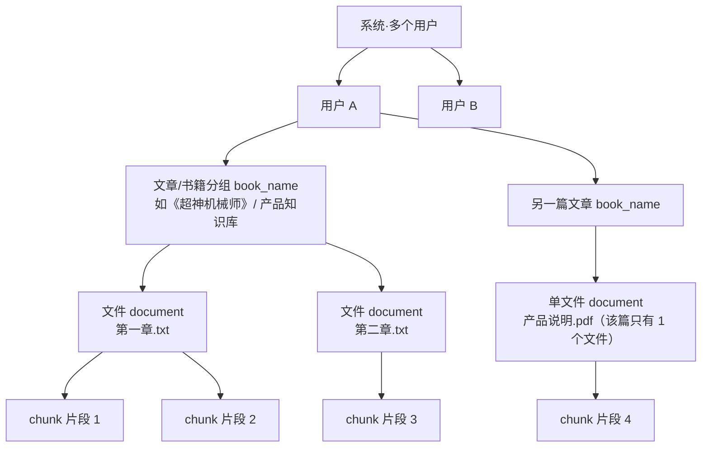
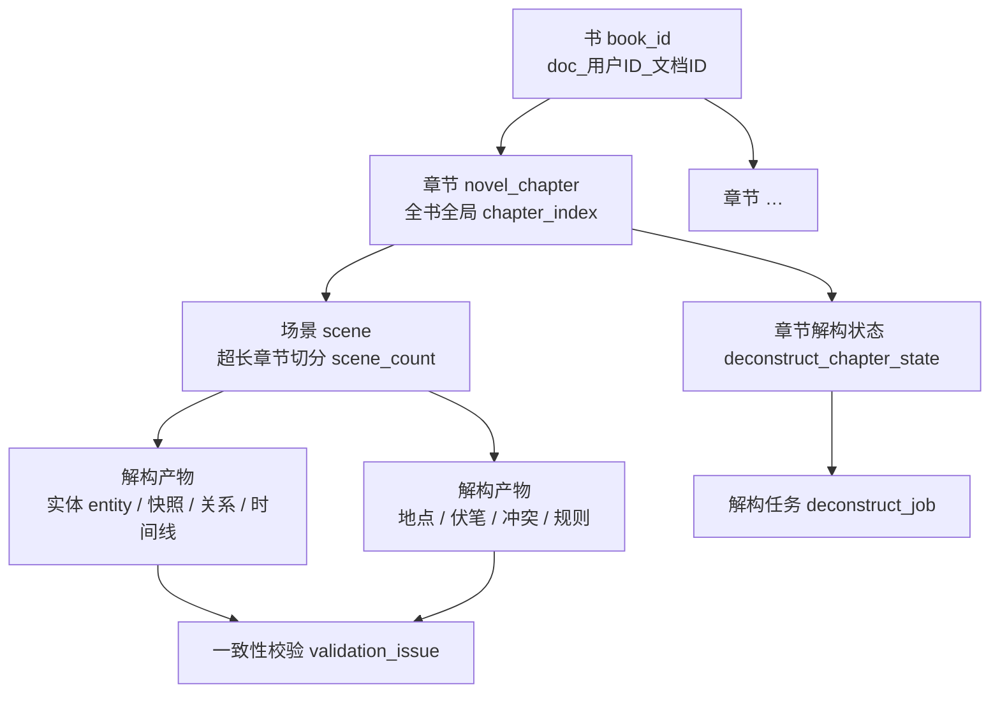
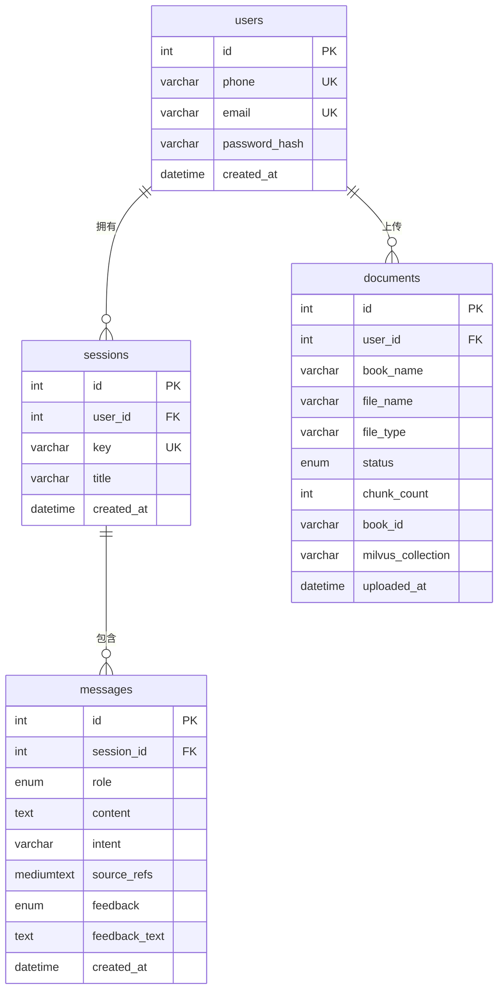
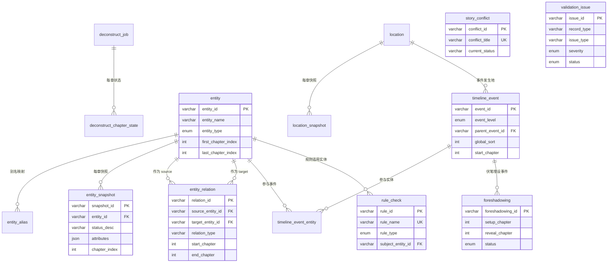

# 数据库设计（AI 智能客服 + 小说解构知识图谱系统）

本文档说明系统的数据库设计，涵盖数据逻辑层级、MySQL **19 张表**的字段/约束/索引/外键、Milvus 向量库结构（chunk 级）与跨库桥接。表结构正本为 `backend/scripts/init_db.sql`（19 张表 DDL）与 ORM 模型 `backend/src/db/models.py`（4 张基础表）+ `backend/src/novel/persistence/models.py`（15 张解构表），向量集合定义正本为 `backend/src/config.py`，本文档与之一一对应，可独立阅读、不依赖跳转。

> **双子系统**：①「AI 智能客服 RAG」子系统（4 张基础表 + Milvus）；②「小说解构 / 知识图谱」子系统（15 张解构表，仅依赖 MySQL + LLM）。本文档 §2/§3 分别说明两套逻辑层级与 ER 关系，§4-§8 为基础子系统，§9 为解构子系统。

---

## 1. 概述

### 1.1 选型

系统使用 **MySQL 8.0** 作为关系型存储，数据库名为 `ai_customer_service`。所有表采用 `InnoDB` 引擎（支持外键与事务），字符集统一 `utf8mb4`（完整支持中文与 emoji，避免生僻字乱码）。选择 MySQL 而非 SQLite/文件存储，是为了满足多用户并发、事务一致性与结构化查询的需求——对话历史、反馈统计、限流计数、解构任务状态、知识图谱节点边等都需要关系型能力。知识片段（向量）则存于 **Milvus** 向量库（见 §8），MySQL 只存文件级元数据，两级各司其职。

### 1.2 初始化方式

数据库有两种建表途径，二者幂等、可并存：

1. **初始化脚本**：`backend/scripts/init_db.sql` 建库建表（所有 `CREATE TABLE` 均带 `IF NOT EXISTS`）。MySQL 容器在首次启动时通过 `/docker-entrypoint-initdb.d/` 自动执行；也可手动执行 `mysql -u root -p < init_db.sql`。
2. **ORM 兜底**：后端启动时执行 `Base.metadata.create_all(engine)`，按 ORM 模型懒建表（覆盖 `db.models` 的 4 张基础表；解构 15 表以 `init_db.sql` 为准）。若 MySQL 未就绪仅告警不致命，运行中可重试。

Milvus 侧在启动时由 `ensure_collection_ready` 自愈校验/创建集合（见 §8），不依赖手工建集。

> **存量补列**：`backend/scripts/migration_confidence.sql` 为解构表幂等补充 `confidence` / `review_status` 两列（先查 `information_schema.COLUMNS`，已存在则跳过，可重复执行）。新库直接由 `init_db.sql` 建出完整结构，无需执行迁移；旧库升级时执行一次即可。

### 1.3 设计总览

系统关系型存储共 **19 张表**，分属两个子系统，职责分明：

**基础子系统（4 张）**

| 表 | 职责 |
| --- | --- |
| users | 用户账号（注册/登录） |
| sessions | 对话会话（每次独立 Session 的记录外壳） |
| messages | 对话消息（**唯一事实源**：历史、引用、反馈、意图全部落此表） |
| documents | 知识库文档（**文件级**元数据，与 Milvus 向量关联） |

**小说解构子系统（15 张）**

| 表 | 职责 |
| --- | --- |
| novel_chapter | 章节原文（解构输入 / 断点续传 / 失败重试的数据源） |
| deconstruct_job | 解构任务（一次 book 解构 = 一个 job） |
| deconstruct_chapter_state | 章节解构状态（每章一行：pending/processing/done/failed） |
| entity | 实体注册表（统一身份锚点，7 类枚举） |
| entity_alias | 实体别名映射（同书同别名归同一实体） |
| location | 地点注册表（1世界/2大陆/3城池/4场景，自引用层级树） |
| entity_snapshot | 实体状态快照（每实体每章一行，时态 as-of N） |
| entity_relation | 实体关系边（章节级动态关系 + 时效区间） |
| timeline_event | 剧情时间线（stage/event 两级，父子层级） |
| timeline_event_entity | 事件↔实体关联（替代逗号分隔，可索引反查） |
| location_snapshot | 地点状态快照（每地点每章一行） |
| foreshadowing | 伏笔与回收（埋设/回收章节 + 状态机） |
| story_conflict | 冲突核心（冲突方 + 状态机） |
| rule_check | 设定规则校验点（能力上限/代价/平衡锁） |
| validation_issue | 一致性校验问题（Layer0/1 拦截 + 人工复核状态机） |

向量存储为 Milvus 集合 `content_knowledge`（**chunk 级**，13 字段 + 512 维 embedding）。MySQL documents（文件级）与 Milvus chunk（片段级）经 **`book_id + file_name`** 双桥接关联。

关系概览（基础子系统）：一个用户可有多个会话（users 1—N sessions）；一个会话包含多条消息（sessions 1—N messages）；一个用户可上传多份文档（users 1—N documents）。解构子系统关系见 §3.2 与 §9 各表。

---

## 2. 逻辑层级

### 2.1 基础子系统：用户 → 文章 → 文档 → 片段

本节说明基础子系统数据从"用户"到"知识片段"的组织层级，以及 MySQL 与 Milvus 的分层存储与桥接关系。这是理解基础表结构与向量集合的前提：系统把一篇"文章"按需拆成一个或多个文件文档，再切成知识片段入库，元数据与片段分别落在 MySQL 与 Milvus。

#### 2.1.1 层级结构



图后说明：层级自上而下是"系统多个用户 → 每个用户多篇文章（book_name 分组）→ 每篇文章 1 到 N 个文件 document → 每个文件多个 chunk 片段"。一篇"文章"可对应一个文件（如单份产品说明文档），也可对应多个文件（如长篇小说按章节拆成多个 txt、企业五年规划白皮书按卷拆成多个文档），这些文件共享同一个 book_name 分组。

#### 2.1.2 逐层说明（代码依据）

| 层级 | 说明 | 代码/存储依据 |
| --- | --- | --- |
| 系统多个用户 | 用户之间完全隔离，各自拥有自己的文章集合 | `documents.user_id` 外键；`book_id` 形如 `doc_{用户id}_{文档id}` 天然带用户维度 |
| 用户多篇文章（book_name） | 一个用户可上传多本不同书名的文章 | `documents` 按 `(user_id, book_name)` 分组；组共享一个 `book_id` 稳定锚点 |
| 一篇 → 1~N 文件 document | 一篇文章（book_name 分组）下可有 1 个或多个文件 | `documents` 行 = **文件级**：每文件一行（file_name/file_type/status/chunk_count） |
| 单文件 → 多 chunk | 一个文件按分块器切成多个知识片段 | 分块器产出 chunk（`.txt/.pdf` 用 NovelTextSplitter 500/120，`.md` 用结构感知分块）；Milvus 存 **chunk 级** |

#### 2.1.3 存储分层与桥接

| 存储 | 粒度 | 存什么 | 用途 |
| --- | --- | --- | --- |
| Milvus（向量库） | chunk 级 | chunk_id 主键、content、embedding(512维)、file_name、book_id、book_name、chapter_title、chunk_index… | 向量检索召回、引用溯源 |
| MySQL（documents 表） | 文件级 | 每文件一行：file_name、book_id、status、chunk_count、milvus_collection、uploaded_at | 权限隔离、上传状态机、列表展示 |

**双桥接**：MySQL 文件行与 Milvus chunk 靠 **`book_id` + `file_name`** 关联——同一文件的所有 chunk 都带相同的 `book_id` 与 `file_name`，因此可按"书"（book_id）整书检索/删除，也可按"文件"（book_id + file_name）单文件定位；`documents.chunk_count` 即该书该文件行对应的 chunk 数。

**为什么分层**：向量检索需要 **chunk 粒度**（片段级相似度召回、引用定位到具体片段）；而权限、上传状态、文件列表等元数据管理需要 **文件粒度**。把大文件的元数据复制进每条 chunk 是浪费，所以两者分离、用 `book_id + file_name` 桥接，最终一致（入库完成后回填 chunk_count）。

### 2.2 解构子系统：用户 → 书 → 章节 → 场景 → 解构产物

小说解构子系统的数据层级建立在同一套 `book_id` 之上：一本书被切成章节、章节切成场景，再由 9 个解构 Agent 产出知识图谱产物。



- **书 → 章节**：`novel_chapter` 每行一章（`chapter_id = nch_{sha1[:20]}` 确定性 ID），`chapter_index` 为全书全局序号（跨文件重编号），`uk(book_id, file_name, chapter_index_in_file)` 保证重传幂等。
- **章节 → 场景**：超长章节（超过 `NOVEL_CHAPTER_MAX_CHARS=10000`）切成多个场景子窗口，`novel_chapter.scene_count` 记录场景数；解构 Agent 按场景分窗口抽取，保证 LLM 输入定长。
- **场景 → 解构产物**：每个场景产出实体/快照/关系/时间线/地点/伏笔/冲突/规则（对应 15 张表），带 `source_chunk_ids`（溯源锚点）与 `confidence`/`review_status`（复核闭环）。
- **任务与状态**：一次解构 = 一个 `deconstruct_job`，每章一行 `deconstruct_chapter_state`（pending→processing→done/failed，支持断点续传与失败重试）。

---

## 3. ER 图

### 3.1 基础子系统（4 表）



图中共有三条一对多关系，含义如下：

- **users → sessions（1 对多）**：一个用户可发起多次独立对话会话，每次会话对应 `sessions` 表一行；会话通过 `user_id` 外键归属用户。
- **users → documents（1 对多）**：一个用户可上传多份知识库文档，文档通过 `user_id` 外键归属用户，实现多用户知识隔离。
- **sessions → messages（1 对多）**：一个会话内按时间顺序包含多条消息，消息通过 `session_id` 外键挂到会话下。

`messages` 不直接关联 `users`，而是经由 `sessions` 间接归属用户——这样"读取某会话历史"和"校验消息归属"都能以会话为纽带一次完成。

> 说明：本 ER 图只含基础子系统四表；知识片段（chunk）不在 MySQL 中，而在 Milvus（§8），二者经 `book_id+file_name` 桥接（§2.1.3）。

### 3.2 解构子系统（15 表，entity 为核心）



关系要点：

- **entity 为图谱核心节点**：`entity_relation` 以 `(source_entity_id, target_entity_id)` 双向指向 entity；`entity_snapshot` 每实体每章一行（时态）；`timeline_event_entity` 记录实体参与的事件；`rule_check.subject_entity_id` 关联规则适用的实体。
- **location 自引用层级树**：`parent_location_id` 指向自身（世界→大陆→城池→场景）。
- **timeline_event 两级 + 自引用**：`event_level=stage`（大阶段）为父、`event`（具体事件）挂 `parent_event_id`；`location_id` 关联发生地点。
- **foreshadowing 依赖 timeline_event**：`setup_event_id`（埋设事件）外键关联；`involved_entity_ids`/`related_foreshadowing_ids` 为 JSON 次轴（非主查询轴）。
- **validation_issue 复核闭环**：`record_type` 指向被拦截的知识行类型，`status`（pending→confirmed/fixed/ignored）承载人工复核状态机。
- **deconstruct_job → deconstruct_chapter_state**：一个任务对应每章一行状态，支持断点续传与失败重试。

---

## 4. users 表（用户表）

存储用户账号信息，支撑注册与登录。密码只存 bcrypt 哈希，不存明文。

### 4.1 字段

| 列名 | 类型 | 空值 | 默认 | 说明 |
| --- | --- | --- | --- | --- |
| id | INT | 否 | AUTO_INCREMENT | 用户主键 |
| phone | VARCHAR(20) | 可空 | — | 手机号，UNIQUE；与 email 至少提供一个 |
| email | VARCHAR(100) | 可空 | — | 邮箱，UNIQUE |
| password_hash | VARCHAR(255) | 否 | — | bcrypt 哈希后的密码 |
| created_at | DATETIME | 否 | CURRENT_TIMESTAMP | 注册时间 |

### 4.2 约束

- `phone`、`email` 各有一个 **UNIQUE** 唯一约束：登录时用手机号或邮箱定位账号，唯一约束同时防止重复注册。
- 登录接口支持用 `phone` 或 `email` 中任一作为 `account` 查询，二者最多有一个有值（注册校验"至少提供其一"）。

---

## 5. sessions 表（会话表）

存储对话会话的外壳记录。会话由前端"新建会话"生成一个 key，首次发送消息时后端按 `(user_id, key)` 自动创建一行。

### 5.1 字段

| 列名 | 类型 | 空值 | 默认 | 说明 |
| --- | --- | --- | --- | --- |
| id | INT | 否 | AUTO_INCREMENT | 会话主键 |
| user_id | INT | 否 | — | 归属用户，外键 → users.id |
| key | VARCHAR(64) | 否 | — | 前端透传的会话字符串（内部键`user_{用户id}_{key}` 的 `{key}` 部分）。`key` 是 MySQL 保留字，DDL 中需用反引号 |
| title | VARCHAR(200) | 可空 | — | 会话标题：首个用户消息发送后自动取消息前 20 字命名；尚无消息时为"新会话" |
| created_at | DATETIME | 否 | CURRENT_TIMESTAMP | 创建时间 |

### 5.2 索引与外键

- `UNIQUE KEY uk_sessions_user_key (user_id, key)`：**同一用户对同一 key 只能有一条会话**，防止前端重复建会话产生脏行。
- `INDEX idx_sessions_user_created (user_id, created_at)`：支撑"会话列表按创建时间倒序"查询。
- 外键 `user_id → users.id`：保证会话必须归属存在的用户。

### 5.3 key 字段语义

`key` 存的是前端每次会话的标识（如 `s1`），它与用户 id 组合成内部键 `user_{uid}_{key}`，作为会话隔离与消息落库的定位依据。key 长度限制 64 位，超过部分在写入前截断，避免超长字符串撑爆列。

---

## 6. messages 表（消息表）

存储全部对话消息，是基础子系统的**唯一事实源**：对话历史、引用来源、反馈、意图都记录在此表，读写集中、避免多套存储不一致。

### 6.1 字段

| 列名 | 类型 | 空值 | 默认 | 说明 |
| --- | --- | --- | --- | --- |
| id | INT | 否 | AUTO_INCREMENT | 消息主键 |
| session_id | INT | 否 | — | 所属会话，外键 → sessions.id |
| role | ENUM('user','assistant','system') | 否 | — | 消息角色：用户 / AI 助手 / 系统 |
| content | TEXT | 否 | — | 消息正文 |
| intent | VARCHAR(50) | 可空 | — | 意图识别标注，取值：产品咨询 / 售后问题 / 闲聊 / 投诉 / 其他 |
| source_refs | MEDIUMTEXT | 可空 | — | 引用来源 JSON 数组（每项`{book_name, file_name, chunk_id}`）。用 MEDIUMTEXT 是防止检索量大时数百条引用（>64KB）超出普通 TEXT 上限 |
| feedback | ENUM('up','down') | 可空 | NULL | 点赞 / 踩 |
| feedback_text | TEXT | 可空 | — | 可选文字反馈 |
| created_at | DATETIME | 否 | CURRENT_TIMESTAMP | 消息时间 |

### 6.2 索引与外键

- `INDEX idx_messages_session (session_id)`：支撑按会话读取历史。
- `INDEX idx_messages_session_role (session_id, role)`：支撑"每日限流"按用户当天 `role='user'` 消息数计数（经 sessions 关联 users）。
- 外键 `session_id → sessions.id`：消息必须挂到存在的会话下。

### 6.3 唯一事实源说明

消息的写入分两步：插入时只写 `role` 与 `content`（由记忆适配器完成，返回自增 `id`）；插入后由 **router 层按 `messages.id` 以 UPDATE 补写** `intent`/`source_refs`/`feedback`/`feedback_text`。这样把"会话内容"与"辅助标注"解耦，记忆适配器不必感知业务字段，同时保证历史/引用/反馈三者在同一行上一致。

---

## 7. documents 表（知识库文档表）

存储知识库文档的**文件级**元数据（基础子系统逻辑层级中的 document 层，见 §2.1），与 Milvus 向量库中的 chunk（知识片段）通过 `book_id` 与 `file_name` 双桥接关联。

### 7.1 字段

| 列名 | 类型 | 空值 | 默认 | 说明 |
| --- | --- | --- | --- | --- |
| id | INT | 否 | AUTO_INCREMENT | 文档主键 |
| user_id | INT | 否 | — | 归属用户，外键 → users.id |
| book_name | VARCHAR(200) | 否 | — | 书目标题分组键（同名的多个文件归入同一本书） |
| file_name | VARCHAR(255) | 否 | — | 文件名 |
| file_type | VARCHAR(10) | 可空 | — | 扩展名（.txt/.md/.pdf） |
| status | ENUM('processing','ready','failed') | 否 | — | 上传状态机：处理中 / 就绪 / 失败 |
| chunk_count | INT | 可空 | — | 切分出的知识片段数，入库完成后回填 |
| book_id | VARCHAR(50) | 可空 | — | 组 book_id 稳定锚点，格式`doc_{用户id}_{文档id}` |
| milvus_collection | VARCHAR(100) | 可空 | — | 存 COLLECTION_REGISTRY 的**key**（如 `content`），非真实物理集合名 |
| uploaded_at | DATETIME | 否 | CURRENT_TIMESTAMP | 上传时间 |

### 7.2 索引与外键

- `INDEX idx_documents_user_uploaded (user_id, uploaded_at)`：支撑文档列表按上传时间倒序查询。
- 外键 `user_id → users.id`：文档归属用户，实现多用户知识隔离。

### 7.3 status 上传状态机

文档上传后先落一行 `processing`，随后后台异步执行"解析 → 分块 → 向量化 → 去重 → 写入 Milvus"，完成更新为 `ready`、失败更新为 `failed`。前端通过文档列表接口轮询状态展示。

### 7.4 book_id 与 milvus_collection 语义

- **book_id**：同一 `(user, book_name)` 分组复用同一个 `book_id`（取该书组首个文件行的 id），多文件（长篇小说/白皮书）共享一个 book_id，支撑跨批 append 与按书整删。它与 Milvus 向量里的 `book_id` 元数据一致，是跨库关联的关键键。
- **milvus_collection**：存逻辑集合 key 而非物理集合名，解耦逻辑与物理集合——registry 变更时存量行无需改动。

---

## 8. Milvus 向量库结构（chunk 级）

向量库存储知识片段（chunk），是基础子系统逻辑层级（§2.1）的最底层落地。本节对照 `backend/src/config.py` 说明集合注册表、schema 字段与索引。

### 8.1 集合注册表

`COLLECTION_REGISTRY` 是"逻辑集合 key → 物理集合定义"的注册表，每项含物理集合名、schema 与索引配置：

| 逻辑 key | 物理集合名 | 用途 |
| --- | --- | --- |
| `content` | `content_knowledge` | 文档内容知识库（默认集合，文档上传写入此集） |

`documents.milvus_collection` 列存的就是逻辑 key（如 `content`），新增一个知识库集合只需在注册表加一项（集合名 + schema + 索引），存量行无需改动。启动时后端对注册表每个 key 执行 `ensure_collection_ready`，自动校验/重建集合与索引。

### 8.2 schema 13 字段

| 字段 | 类型 | 说明 |
| --- | --- | --- |
| chunk_id | VARCHAR(100) | **主键**，文本块唯一标识 |
| content | VARCHAR(2000) | 文本块原文内容 |
| file_name | VARCHAR(200) | 所属源文件名（与 MySQL documents.file_name 对应，桥接字段之一） |
| book_id | VARCHAR(50) | 所属书籍标识（与 MySQL documents.book_id 对应，桥接字段之一） |
| book_name | VARCHAR(200) | 所属书籍/分组名 |
| content_hash | VARCHAR(32) | 内容 MD5 指纹，用于精确去重 |
| chapter_title | VARCHAR(200) | 所属章节标题 |
| chapter_index | INT32 | 所属章节序号 |
| chunk_index | INT32 | 文档内文本块序号 |
| chunk_size | INT32 | 文本块字符长度 |
| file_type | VARCHAR(20) | 文件类型后缀 |
| uploaded_at | INT64 | chunk 入库时间戳（unix 毫秒） |
| embedding | FLOAT_VECTOR(512) | 文本向量表征（BGE 512 维） |

### 8.3 向量索引

`embedding` 字段使用 `IVF_FLAT` / `COSINE` / `nlist=128`。IVF 聚类适合中等规模向量库、查询快；COSINE 度量适配 BGE 中文语义向量（余弦相似度）。

### 8.4 与 MySQL 双桥接落地

MySQL documents（文件级）与 Milvus chunk（片段级）的关联关系（概念见 §2.1.3）在字段层的落地如下：

| 桥接维度 | 关联方式 | 用途 |
| --- | --- | --- |
| 按书（book_id） | `documents.book_id` = chunk 的 `book_id` 元数据 | 整书检索过滤、整书删除 |
| 按文件（book_id + file_name） | 同一文件所有 chunk 带相同`book_id` + `file_name` | 单文件定位、单文件删除 |
| 片段计数 | `documents.chunk_count` = 该书该文件行对应的 chunk 数 | 文档列表展示、增量对账 |

> **解构子系统与 Milvus 的关系**：小说解构（15 张解构表）**不依赖 Milvus**。解构的章节切分只读复用 `RAG.TextSplitter`/`RAG.DocumentLoader` 的检测逻辑（`novel/pipeline/chapters.py` 注明"只读复用、不改其代码"），**解构期不产生、不重建 Milvus chunk**（`novel/__init__.py`）。上传 `deconstruct=1` 时解构与 Milvus 入库并行执行但彼此独立。

---

## 9. 小说解构子系统表（15 张）

> 本节逐表说明解构子系统的 15 张表。字段/约束/索引/外键以 `backend/scripts/init_db.sql` 与 `backend/src/novel/persistence/models.py` 为准。**共同约定**：
> - **11 张"知识产物"表**（§9.4 entity ~ §9.14 rule_check）均带 `confidence DECIMAL(3,2)`（置信度 0~1，NULL=未复核）与 `review_status VARCHAR(20)`（NULL/confirmed/fixed/ignored），构成复核闭环；`source_chunk_ids` 记录原文 chunk 溯源锚点。
> - **4 张例外表不带 confidence/review_status**：`novel_chapter` / `deconstruct_job` / `deconstruct_chapter_state`（流水线/任务表，非知识行）、`validation_issue`（复核问题表本身）。
> - **二阶段 11 个叙事新列**（entity 的 `narrative_role`/`arc_type`/`core_baseline`、entity_relation 的 `surface_relation`/`inner_relation`/`relation_trend`、timeline_event 的 `narrative_type`/`plot_impact`、foreshadowing 的 `foreshadowing_type`/`concealment_level`/`misleading_info`）服务于实体卡 **L0-L4 叙事层**（身份锚点/静态基线/明暗关系/叙事功能/悬念感，见 `分析文档/014`），由提取层（prompt/02/03）写入、聚合层（`get_entity_card`/04）读出。

### 9.1 novel_chapter（章节原文表）

**用途**：解构输入 / 断点续传 / 失败重试的数据源。同一本书、同一文件、同一章只存一行（重传走 ON DUPLICATE KEY UPDATE 幂等更新）。

| 列名 | 类型 | 空值 | 默认 | 说明 |
| --- | --- | --- | --- | --- |
| id | INT | 否 | AUTO_INCREMENT | 主键 |
| chapter_id | VARCHAR(64) | 否 | — | `nch_{sha1(book_id\|file_name\|chapter_index_in_file)[:20]}`，确定性 ID |
| book_id | VARCHAR(50) | 否 | — | `doc_{user_id}_{doc_id}` |
| book_name | VARCHAR(200) | 否 | — | 书名 |
| file_name | VARCHAR(255) | 否 | — | 所属源文件（跨文件章节去重/溯源） |
| chapter_index | INT | 否 | — | 全书全局章节序号（跨文件重编号，11 表锚点） |
| chapter_index_in_file | INT | 否 | — | 文件内 0-based（对齐 Milvus chunk chapter_index） |
| chapter_title | VARCHAR(200) | 否 | — | 章节标题 |
| chapter_text | MEDIUMTEXT | 否 | — | 章节原文（解构输入） |
| char_offset_start | INT | 否 | 0 | 章节在清洗后文档文本中的字符偏移起点 |
| char_offset_end | INT | 否 | 0 | 字符偏移终点 |
| scene_count | INT | 否 | 1 | 场景子窗口数（超长章节 LLM 输入定大小） |
| created_at | DATETIME | 否 | CURRENT_TIMESTAMP | 创建时间 |
| updated_at | DATETIME | 否 | CURRENT_TIMESTAMP ON UPDATE | 更新时间 |

**约束**：`UNIQUE uk_novel_chapter (book_id, file_name, chapter_index_in_file)`（幂等重传）；`INDEX idx_novel_chapter_book (book_id, chapter_index)`、`idx_novel_chapter_file (book_id, file_name)`。

### 9.2 deconstruct_job（解构任务表）

**用途**：一次 book 解构 = 一个 job，承载断点续传/进度/汇总。

| 列名 | 类型 | 空值 | 默认 | 说明 |
| --- | --- | --- | --- | --- |
| id | INT | 否 | AUTO_INCREMENT | 主键 |
| job_id | VARCHAR(64) | 否 | — | `djob_{snowflake}` |
| book_id | VARCHAR(50) | 否 | — | 被解构的书 |
| user_id | INT | 否 | — | 发起用户 |
| trigger_type | ENUM('upload','manual') | 否 | 'upload' | 触发方式：上传自动 / 手动一键解构 |
| total_chapters | INT | 否 | 0 | 章节总数 |
| done_chapters | INT | 否 | 0 | 已完成章节数 |
| failed_chapters | INT | 否 | 0 | 失败章节数 |
| status | ENUM('pending','running','done','failed') | 否 | 'pending' | 任务状态 |
| error_msg | TEXT | 可空 | — | 错误信息 |
| started_at | DATETIME | 否 | CURRENT_TIMESTAMP | 开始时间 |
| finished_at | DATETIME | 可空 | — | 结束时间 |
| created_at | DATETIME | 否 | CURRENT_TIMESTAMP | 创建时间 |

**约束**：`UNIQUE uk_deconstruct_job (job_id)`；`INDEX idx_deconstruct_job_book (book_id, status)`、`idx_deconstruct_job_user (user_id, created_at)`。

### 9.3 deconstruct_chapter_state（章节解构状态表）

**用途**：每章节一行，记录解构进度与溯源锚点；同一 job 里每章只一行（重跑幂等）。

| 列名 | 类型 | 空值 | 默认 | 说明 |
| --- | --- | --- | --- | --- |
| id | INT | 否 | AUTO_INCREMENT | 主键 |
| job_id | VARCHAR(64) | 否 | — | 所属任务 |
| chapter_id | VARCHAR(64) | 否 | — | novel_chapter.chapter_id |
| book_id | VARCHAR(50) | 否 | — | 所属书 |
| chapter_index | INT | 否 | — | 全局章节序号 |
| scene_count | INT | 否 | 1 | 场景数 |
| status | ENUM('pending','processing','done','failed') | 否 | 'pending' | 章节解构状态 |
| retry_count | INT | 否 | 0 | 重试次数 |
| shrink_level | TINYINT | 否 | 0 | LLM 缩窗重试层级 |
| error_msg | TEXT | 可空 | — | 错误信息 |
| started_at | DATETIME | 可空 | — | 开始时间 |
| finished_at | DATETIME | 可空 | — | 结束时间 |
| created_at | DATETIME | 否 | CURRENT_TIMESTAMP | 创建时间 |

**约束**：`UNIQUE uk_chapter_state (job_id, chapter_id)`；`INDEX idx_chapter_state_job_status (job_id, status)`、`idx_chapter_state_book (book_id, chapter_index)`。

### 9.4 entity（实体注册表）

**用途**：实体节点，`entity_id` 为全局稳定身份锚点；同一实体跨章节复用同一 id。7 类枚举：`human`（人物）/ `item`（物品）/ `skill`（技能/功法）/ `spirit`（非人类智慧体）/ `task`（任务）/ `faction`（势力/门派）/ `rule`（规则/设定）。

| 列名 | 类型 | 空值 | 默认 | 说明 |
| --- | --- | --- | --- | --- |
| id | INT | 否 | AUTO_INCREMENT | 主键 |
| entity_id | VARCHAR(100) | 否 | — | `ent_{snowflake}`，稳定业务 ID |
| entity_name | VARCHAR(200) | 否 | — | 规范名 |
| entity_type | ENUM('human','item','skill','spirit','task','faction','rule') | 否 | — | 实体类型 |
| description | TEXT | 可空 | — | 描述（原文依据摘要） |
| book_id | VARCHAR(50) | 否 | — | 所属书 |
| first_chapter_index | INT | 否 | — | 首次出现章节 |
| last_chapter_index | INT | 否 | — | 最近出现章节 |
| is_active | TINYINT(1) | 否 | 1 | 活跃标记 |
| confidence | DECIMAL(3,2) | 可空 | NULL | 置信度 0~1；NULL=未复核 |
| review_status | VARCHAR(20) | 可空 | NULL | NULL/confirmed/fixed/ignored |
| narrative_role | VARCHAR(50) | 可空 | NULL | 叙事定位：主角/核心配角/反派/导师/镜像/喜剧担当 |
| arc_type | VARCHAR(50) | 可空 | NULL | 弧光类型：成长型/堕落型/救赎型/悲剧型/工具型 |
| core_baseline | TEXT | 可空 | NULL | 核心基线：欲望/恐惧/执念/决策权重（JSON 或文本） |
| created_at | DATETIME | 否 | CURRENT_TIMESTAMP | 创建时间 |

**约束**：`UNIQUE uk_entity_entity_id (entity_id)`；`INDEX idx_entity_book_type (book_id, entity_type)`、`idx_entity_book_name (book_id, entity_name)`。

### 9.5 entity_alias（实体别名映射表）

**用途**：统一"同物异名"到同一 entity_id。**同书内一个别名只归一个实体**（`uk_alias_book_alias` 的 DB 保证，是别名消解的关键）。

| 列名 | 类型 | 空值 | 默认 | 说明 |
| --- | --- | --- | --- | --- |
| id | INT | 否 | AUTO_INCREMENT | 主键 |
| entity_id | VARCHAR(100) | 否 | — | 所属实体，外键 → entity.entity_id |
| alias_name | VARCHAR(200) | 否 | — | 别名 |
| alias_type | ENUM('full_name','nickname','title','pronoun','typo') | 否 | 'nickname' | 别名类型：全名/昵称/称号/代词/错字 |
| book_id | VARCHAR(50) | 否 | — | 所属书 |
| source_chunk_ids | VARCHAR(500) | 可空 | — | 溯源锚点 |
| confidence / review_status / created_at | — | — | — | 同 §9.4 |

**约束**：`UNIQUE uk_alias_book_alias (book_id, alias_name)`；`INDEX idx_alias_entity (book_id, entity_id)`；外键 `entity_id → entity(entity_id)`。

### 9.6 location（地点注册表）

**用途**：地点节点与自引用层级树（1世界/2大陆/3城池/4具体场景）；`timeline_event.location_id` 的 FK 依赖本表。

| 列名 | 类型 | 空值 | 默认 | 说明 |
| --- | --- | --- | --- | --- |
| id | INT | 否 | AUTO_INCREMENT | 主键 |
| location_id | VARCHAR(100) | 否 | — | 地点业务 ID |
| location_name | VARCHAR(200) | 否 | — | 地点名 |
| location_level | TINYINT | 否 | — | 1世界/2大陆/3城池/4具体场景 |
| parent_location_id | VARCHAR(100) | 可空 | — | 上级地点，外键自引用 → location.location_id |
| description | TEXT | 可空 | — | 地点描述 |
| book_id | VARCHAR(50) | 否 | — | 所属书 |
| first_chapter_index | INT | 否 | — | 首次出现章节 |
| last_chapter_index | INT | 否 | — | 最近出现章节 |
| confidence / review_status / created_at | — | — | — | 同 §9.4 |

**约束**：`UNIQUE uk_location_id (location_id)`（供外键引用）+ `uk_location_book (book_id, location_id)`（同书内地点不重复）；`INDEX idx_location_parent (book_id, parent_location_id)`；外键 `parent_location_id → location(location_id)`。

### 9.7 entity_snapshot（实体状态快照表）

**用途**：每实体每章节一行，承载实体在当前剧情节点的即时状态，是**时态 as-of N** 的核心（`uk_entity_snapshot` 幂等 upsert）。

| 列名 | 类型 | 空值 | 默认 | 说明 |
| --- | --- | --- | --- | --- |
| id | INT | 否 | AUTO_INCREMENT | 主键 |
| snapshot_id | VARCHAR(100) | 否 | — | `s_{entity_id}_{chapter}` |
| entity_id | VARCHAR(100) | 否 | — | 所属实体，外键 → entity.entity_id |
| entity_name | VARCHAR(200) | 否 | — | 实体名（冗余，便于查询） |
| entity_type | ENUM(7 类) | 否 | — | 实体类型 |
| status_desc | VARCHAR(1000) | 否 | — | 本章状态描述（觉醒反转术式/肉身孱弱/一级战力） |
| attributes | JSON | 可空 | — | 自由属性（技能威力/物品功能/任务目标/势力规模，MySQL 原生 JSON） |
| book_id | VARCHAR(50) | 否 | — | 所属书 |
| chapter_index | INT | 否 | — | 章节 |
| source_chunk_ids | VARCHAR(500) | 可空 | — | 溯源锚点 |
| confidence / review_status / created_at | — | — | — | 同 §9.4 |

**约束**：`UNIQUE uk_entity_snapshot (book_id, entity_id, chapter_index)`；`INDEX idx_entity_snapshot_entity (entity_id, chapter_index)`；外键 `entity_id → entity(entity_id)`。

### 9.8 entity_relation（实体关系边）

**用途**：章节级动态关系 + 时效区间。`relation_type` 枚举（跨题材通用）：`possess`（持有）/ `master`（主从）/ `contain`（包含）/ `restrain`（克制）/ `undertake`（承担）/ `belong_to`（隶属）/ `host_bind`（宿主绑定）/ `alliance`（同盟）/ `enmity`（敌对）/ `family`（亲属）。

| 列名 | 类型 | 空值 | 默认 | 说明 |
| --- | --- | --- | --- | --- |
| id | INT | 否 | AUTO_INCREMENT | 主键 |
| relation_id | VARCHAR(100) | 否 | — | `rel_{snowflake}` |
| source_entity_id | VARCHAR(100) | 否 | — | 主体实体，外键 → entity.entity_id |
| source_entity_type | ENUM(7 类) | 否 | — | 主体类型 |
| target_entity_id | VARCHAR(100) | 否 | — | 客体实体，外键 → entity.entity_id |
| target_entity_type | ENUM(7 类) | 否 | — | 客体类型 |
| relation_type | VARCHAR(50) | 否 | — | 关系类型枚举 |
| relation_desc | VARCHAR(500) | 可空 | — | 关系补充描述 |
| relation_weight | TINYINT | 否 | 2 | 1=核心强关系 / 2=次要弱关系 |
| valid_period | ENUM('permanent','temporary','reversed') | 否 | 'temporary' | 时效：永久/临时/反转 |
| start_chapter | INT | 否 | — | 关系起始生效章节 |
| end_chapter | INT | 否 | 0 | 结束章节，0=永久/当前有效 |
| book_id | VARCHAR(50) | 否 | — | 所属书 |
| chapter_index | INT | 否 | — | 关系被观测/建立的章节 |
| source_chunk_ids | VARCHAR(500) | 可空 | — | 溯源锚点 |
| confidence | DECIMAL(3,2) | 可空 | NULL | 置信度 0~1；NULL=未复核 |
| review_status | VARCHAR(20) | 可空 | NULL | NULL/confirmed/fixed/ignored |
| surface_relation | VARCHAR(300) | 可空 | NULL | 对外公开的表层关系 |
| inner_relation | VARCHAR(300) | 可空 | NULL | 双方内心真实态度与隐情（合理推断，需原文锚点） |
| relation_trend | VARCHAR(20) | 可空 | NULL | 关系趋势：升温/降温/稳定/破裂 |
| created_at | DATETIME | 否 | CURRENT_TIMESTAMP | 创建时间 |

**约束**：`UNIQUE uk_relation (book_id, source_entity_id, target_entity_id, relation_type, start_chapter)`；`INDEX idx_relation_source/target/type`；外键 `source_entity_id`/`target_entity_id → entity(entity_id)`。

> **时态语义**：`start_chapter ≤ N` 且（`end_chapter = 0` 或 `end_chapter ≥ N`）的关系在 as-of N 视图有效；`valid_period=reversed` 表示本章明确反转的原有关系。

### 9.9 timeline_event（剧情时间线表）

**用途**：阶段(stage)+事件(event)两级、父子层级。`event_level=stage`（大阶段，如"怀玉篇"）为父；`event`（具体事件）挂 `parent_event_id`。

| 列名 | 类型 | 空值 | 默认 | 说明 |
| --- | --- | --- | --- | --- |
| id | INT | 否 | AUTO_INCREMENT | 主键 |
| event_id | VARCHAR(100) | 否 | — | `ev_{snowflake}` |
| event_level | ENUM('stage','event') | 否 | — | 层级 |
| parent_event_id | VARCHAR(100) | 可空 | — | 所属阶段；stage 为 NULL；自引用外键 → timeline_event.event_id |
| event_title | VARCHAR(200) | 否 | — | 事件标题 |
| event_content | TEXT | 可空 | — | 事件详细内容 |
| time_desc | VARCHAR(200) | 可空 | — | 文本内时间描述（怀玉篇/三年后） |
| global_sort | INT | 否 | — | 全书全局时序排序号 |
| start_chapter | INT | 否 | — | 起始章节 |
| end_chapter | INT | 否 | — | 结束章节 |
| location_id | VARCHAR(100) | 可空 | — | 发生地点，外键 → location.location_id |
| book_id | VARCHAR(50) | 否 | — | 所属书 |
| source_chunk_ids | VARCHAR(500) | 可空 | — | 溯源锚点 |
| confidence | DECIMAL(3,2) | 可空 | NULL | 置信度 0~1；NULL=未复核 |
| review_status | VARCHAR(20) | 可空 | NULL | NULL/confirmed/fixed/ignored |
| narrative_type | VARCHAR(50) | 可空 | NULL | 叙事类型：升级/打脸/揭秘/转折/战斗/过渡 |
| plot_impact | VARCHAR(500) | 可空 | NULL | 对主线剧情的影响（一句话） |
| created_at | DATETIME | 否 | CURRENT_TIMESTAMP | 创建时间 |

**约束**：`UNIQUE uk_event_id (event_id)`（供外键引用）+ `uk_timeline (book_id, event_id)`（同书内事件不重复）；`INDEX idx_timeline_parent/chapter/sort`；外键 `parent_event_id → timeline_event(event_id)`（自引用）、`location_id → location(location_id)`。

### 9.10 timeline_event_entity（事件↔实体关联表）

**用途**：替代逗号分隔 `involved_entity_ids`，可索引反查"某实体参与的所有事件"。

| 列名 | 类型 | 空值 | 默认 | 说明 |
| --- | --- | --- | --- | --- |
| id | INT | 否 | AUTO_INCREMENT | 主键 |
| event_id | VARCHAR(100) | 否 | — | 事件，外键 → timeline_event.event_id |
| entity_id | VARCHAR(100) | 否 | — | 实体，外键 → entity.entity_id |
| role | VARCHAR(50) | 否 | '在场' | 参与角色（主角/敌对/见证…） |
| book_id | VARCHAR(50) | 否 | — | 所属书 |
| chapter_index | INT | 否 | — | 章节 |
| confidence / review_status | — | — | — | 同 §9.4 |

**约束**：`UNIQUE uk_event_entity (event_id, entity_id)`；`INDEX idx_event_entity_entity (book_id, entity_id, chapter_index)`（反查）；外键 `event_id → timeline_event(event_id)`、`entity_id → entity(entity_id)`。

### 9.11 location_snapshot（地点状态快照表）

**用途**：每地点每章一行，记录地点即时状态与生效规则。

| 列名 | 类型 | 空值 | 默认 | 说明 |
| --- | --- | --- | --- | --- |
| id | INT | 否 | AUTO_INCREMENT | 主键 |
| snapshot_id | VARCHAR(100) | 否 | — | 快照 ID |
| location_id | VARCHAR(100) | 否 | — | 地点，外键 → location.location_id |
| location_name | VARCHAR(200) | 否 | — | 地点名（冗余） |
| status_desc | VARCHAR(1000) | 可空 | — | 开启/封印/损毁/阵法激活 |
| special_rules | VARCHAR(1000) | 可空 | — | 本章生效特殊规则 |
| book_id | VARCHAR(50) | 否 | — | 所属书 |
| chapter_index | INT | 否 | — | 章节 |
| source_chunk_ids | VARCHAR(500) | 可空 | — | 溯源锚点 |
| confidence / review_status / created_at | — | — | — | 同 §9.4 |

**约束**：`UNIQUE uk_location_snapshot (book_id, location_id, chapter_index)`；`INDEX idx_location_snapshot_loc (location_id, chapter_index)`；外键 `location_id → location(location_id)`。

### 9.12 foreshadowing（伏笔表）

**用途**：伏笔埋设/回收全生命周期，状态机 `pending → revealed / abandoned`。

| 列名 | 类型 | 空值 | 默认 | 说明 |
| --- | --- | --- | --- | --- |
| id | INT | 否 | AUTO_INCREMENT | 主键 |
| foreshadowing_id | VARCHAR(100) | 否 | — | `fs_{snowflake}` |
| book_id | VARCHAR(50) | 否 | — | 所属书 |
| title | VARCHAR(200) | 可空 | — | 伏笔名 |
| description | TEXT | 可空 | — | 伏笔内容描述 |
| setup_chapter | INT | 否 | — | 埋设章节 |
| setup_event_id | VARCHAR(100) | 可空 | — | 埋设事件，外键 → timeline_event.event_id |
| involved_entity_ids | JSON | 可空 | — | 涉及实体（非主查询轴，用 JSON） |
| reveal_chapter | INT | 可空 | — | 回收章节 |
| reveal_event_id | VARCHAR(100) | 可空 | — | 回收事件 |
| status | ENUM('pending','revealed','abandoned') | 否 | 'pending' | 状态 |
| related_foreshadowing_ids | JSON | 可空 | — | 关联伏笔 |
| source_chunk_ids | VARCHAR(500) | 可空 | — | 溯源锚点 |
| confidence | DECIMAL(3,2) | 可空 | NULL | 置信度 0~1；NULL=未复核 |
| review_status | VARCHAR(20) | 可空 | NULL | NULL/confirmed/fixed/ignored |
| foreshadowing_type | VARCHAR(50) | 可空 | NULL | 伏笔类型：道具/人物/剧情/世界观/细节/能力/关系/冲突/时间线/规则等 |
| concealment_level | TINYINT | 可空 | NULL | 埋设隐蔽度 1-10（1明显~10极隐蔽） |
| misleading_info | VARCHAR(500) | 可空 | NULL | 误导信息（迷惑读者的虚假线索） |
| created_at | DATETIME | 否 | CURRENT_TIMESTAMP | 创建时间 |

**约束**：`UNIQUE uk_foreshadowing (book_id, foreshadowing_id)`；`INDEX idx_foreshadowing_chapter (book_id, status, setup_chapter)`、`idx_foreshadowing_reveal (book_id, reveal_chapter)`；外键 `setup_event_id → timeline_event(event_id)`。

### 9.13 story_conflict（冲突核心表）

**用途**：冲突方 + 状态机；`uk_conflict_book_title`（同书同标题单行）为业务键。

| 列名 | 类型 | 空值 | 默认 | 说明 |
| --- | --- | --- | --- | --- |
| id | INT | 否 | AUTO_INCREMENT | 主键 |
| conflict_id | VARCHAR(100) | 否 | — | `cfl_{snowflake}` |
| book_id | VARCHAR(50) | 否 | — | 所属书 |
| conflict_title | VARCHAR(200) | 否 | — | 冲突名 |
| conflict_type | VARCHAR(50) | 可空 | — | 对抗/资源争夺/价值观冲突/欲望冲突 |
| conflict_desc | TEXT | 可空 | — | 冲突描述 |
| side_a | VARCHAR(500) | 可空 | — | 冲突方A（实体ID/势力名） |
| side_b | VARCHAR(500) | 可空 | — | 冲突方B |
| start_chapter | INT | 否 | — | 起始章节 |
| end_chapter | INT | 可空 | — | 结束章节 |
| current_status | VARCHAR(50) | 可空 | '升级' | 升级/胶着/解决 |
| escalated_event_ids | JSON | 可空 | — | 关键推进事件 ID |
| source_chunk_ids | VARCHAR(500) | 可空 | — | 溯源锚点 |
| confidence / review_status / created_at | — | — | — | 同 §9.4 |

**约束**：`UNIQUE uk_conflict (book_id, conflict_id)` + `uk_conflict_book_title (book_id, conflict_title)`；`INDEX idx_conflict_status (book_id, current_status, start_chapter)`。无外键（side 用文本，不强绑 entity）。

### 9.14 rule_check（设定规则校验点表）

**用途**：能力上限/代价/平衡锁/生效条件，防战力崩坏、防 LLM 违反设定。`rule_type`：`cap`（上限）/ `cost`（代价）/ `balance_lock`（平衡锁）/ `condition`（生效条件）/ `other`。

| 列名 | 类型 | 空值 | 默认 | 说明 |
| --- | --- | --- | --- | --- |
| id | INT | 否 | AUTO_INCREMENT | 主键 |
| rule_id | VARCHAR(100) | 否 | — | `rul_{snowflake}` |
| book_id | VARCHAR(50) | 否 | — | 所属书 |
| rule_name | VARCHAR(200) | 否 | — | 规则名 |
| rule_type | ENUM('cap','cost','balance_lock','condition','other') | 否 | 'other' | 规则类型 |
| rule_content | TEXT | 否 | — | 能力上限/代价/平衡锁原文 |
| subject_entity_id | VARCHAR(100) | 可空 | — | 规则适用实体，外键 → entity.entity_id |
| subject_ability | VARCHAR(200) | 可空 | — | 适用能力/术式 |
| valid_from_chapter | INT | 否 | 1 | 生效起始章节 |
| valid_to_chapter | INT | 可空 | 0 | 生效结束章节，0=永久有效 |
| last_check_result | VARCHAR(500) | 可空 | — | 最近一次设定校验结论（违反/通过/存疑） |
| source_chunk_ids | VARCHAR(500) | 可空 | — | 溯源锚点 |
| confidence / review_status | — | — | — | 同 §9.4 |
| created_at / updated_at | DATETIME | 否 | CURRENT_TIMESTAMP | 创建 / 更新时间 |

**约束**：`UNIQUE uk_rule_check (book_id, rule_id)` + `uk_rule_book_name (book_id, rule_name)`；`INDEX idx_rule_check_entity (book_id, rule_type, subject_entity_id)`；外键 `subject_entity_id → entity(entity_id)`。

### 9.15 validation_issue（一致性校验问题表）

**用途**：Layer 0/1 拦截项 / 关键记录冲突 / 无原文锚点疑似幻觉 → 挂起人工复核。状态机 `pending → confirmed / fixed / ignored`。本表与 11 张知识产物表的 `confidence`/`review_status` 列共同构成「Agent 可靠性体系（三层校验 + 人工复核闭环，见《AI架构设计.md》§23）」的落库层。

| 列名 | 类型 | 空值 | 默认 | 说明 |
| --- | --- | --- | --- | --- |
| id | INT | 否 | AUTO_INCREMENT | 主键 |
| issue_id | VARCHAR(64) | 否 | — | `vis_{snowflake}` |
| book_id | VARCHAR(50) | 否 | — | 所属书 |
| job_id | VARCHAR(64) | 否 | — | 所属解构任务 |
| chapter_id | VARCHAR(64) | 可空 | — | 关联章节（可空=书级问题） |
| record_type | VARCHAR(50) | 否 | — | 被拦截记录类型：entity_relation/entity_snapshot/timeline_event/rule_check… |
| issue_type | VARCHAR(50) | 否 | — | 问题类型：semantic_conflict/timeline_paradox/state_jump/rule_violation/unsupported_change |
| severity | ENUM('info','warning','critical') | 否 | 'warning' | 严重度 |
| status | ENUM('pending','confirmed','fixed','ignored') | 否 | 'pending' | 复核状态 |
| description | TEXT | 可空 | — | 冲突说明 |
| original_value | VARCHAR(2000) | 可空 | — | 冲突前已入库值（保留，不覆写） |
| suggested_value | VARCHAR(2000) | 可空 | — | 新抽取值（挂起待人工裁决） |
| target_id | VARCHAR(100) | 可空 | — | 目标知识行业务键（复核回写定位用） |
| resolved_by | VARCHAR(100) | 可空 | — | 人工确认人/方式 |
| resolved_at | DATETIME | 可空 | — | 确认时间 |
| created_at | DATETIME | 否 | CURRENT_TIMESTAMP | 创建时间 |

**约束**：`UNIQUE uk_validation_issue (issue_id)`；`INDEX idx_validation_issue_book (book_id, status)`、`idx_validation_issue_job (job_id)`。无外键（`target_id` 为业务键，与知识行解耦）。

---

## 10. 关键设计说明

### 10.1 基础子系统（原有）

1. **sessions 唯一约束 (user_id, key)**：为什么——同一用户对同一会话 key 只允许一行，避免前端重复"新建会话"产生脏行；创建采用"查不到才 INSERT + 并发撞唯一约束回滚重查"的兜底，天然幂等。
2. **messages 为唯一事实源**：为什么——对话历史、引用、反馈、意图集中在单表，读写都走同一份数据，杜绝"文件记忆与数据库不一致"；辅助字段由 router 层按消息 id 补写，职责分离、易排查。
3. **book_id 分组复用**：为什么——以 `(user, book_name)` 为分组键，使同一本书多次上传、追加章节都能复用同一标识，便于整书检索过滤与整书删除，同时维持用户间隔离。
4. **source_refs 用 MEDIUMTEXT**：为什么——检索/重排序配置较高时引用可达数百条（JSON 超过普通 TEXT 的 64KB 上限），MEDIUMTEXT（16MB）从根上避免"Data too long"写入失败。
5. **milvus_collection 存 key 而非物理集合名**：为什么——把"逻辑知识库"与"物理 Milvus 集合"解耦，集合改名/迁移不影响存量文档行。
6. **MySQL 与 Milvus 分层**：为什么——向量检索需要 chunk 粒度、元数据/权限/状态需要文件粒度，两级用 `book_id+file_name` 桥接（见 §2.1.3），避免把大文件元数据复制进每条 chunk。
7. **回滚策略**：为什么——回滚脚本 `rollback.sql` 与建表脚本 `init_db.sql` 分离（init 脚本若含 DROP 会在容器首启时立即删库）；回滚按逆序 DROP（messages→sessions→documents→users）再删库，符合外键依赖顺序。

### 10.2 解构子系统（新增）

8. **幂等键 `uk_*` + ON DUPLICATE KEY UPDATE**：为什么——解构可能重跑（重传/断点续传/失败重试），每张解构表都用业务唯一键保证"同一条知识只落一行"：章节 `uk(book_id, file_name, chapter_index_in_file)`、快照 `uk(book_id, entity_id, chapter_index)`、关系 `uk(source, target, relation_type, start_chapter)`、事件 `uk(book_id, event_id)`、伏笔/冲突/规则同书同标题单行等。重跑走更新而非插入，避免脏数据堆积。
9. **时态 as-of N（快照按章回填）**：为什么——实体卡片/图谱按"截至第 N 章"呈现全貌，而非单章碎片。`entity_snapshot`/`location_snapshot` 每实体（地点）每章一行；查询取 `chapter_index ≤ N` 的**最近一条非空值**回填（`get_latest_snapshot_at_chapter`），关系按 `start_chapter ≤ N ≤ (end_chapter=0 或 ≥N)` 过滤（`get_valid_relations_at_chapter`）。这是"实体卡不盲人摸象"的数据基础。
10. **confidence/review_status 复核闭环**：为什么——解构产物的主观推断（关系方向、伏笔判定）需人工兜底。**11 张"知识产物"表**（entity/alias/location/snapshot/relation/timeline/timeline_event_entity/foreshadowing/conflict/rule_check）均带 `confidence`（0~1，NULL=未复核）与 `review_status`（confirmed/fixed/ignored）；任务/流水线表（novel_chapter、deconstruct_job、deconstruct_chapter_state）与复核问题表 `validation_issue` 不带这两列。一致性校验 Agent 命中冲突时写入 `validation_issue`，经复核工作台裁决（confirm/ignore/fix/repersist）后回写知识行。低置信度在 UI 上弱视觉展示（待复核徽标）。
11. **name→entity_id 跨章解析**：为什么——解构 Agent 按"名"引用实体（快照/关系/事件用实体名输出），persist 层跨章解析为 `entity_id`；`entity_alias.uk(book_id, alias_name)` 保证同书一个别名只归一个实体，是消解"同物异名/跨章复用"的 DB 保证。
12. **relation 时效区间**：为什么——网文关系是动态的（师徒反目、盟友变敌），用 `start_chapter`/`end_chapter` + `valid_period`（permanent/temporary/reversed）表达"关系在哪段时间成立、是否被反转"，支撑图谱按时间回放。
13. **`validation_issue` 与知识行解耦**：为什么——`target_id` 用业务键而非外键，使复核修正（repersist）不依赖知识行存在，且保留 `original_value`（不覆写历史），人工裁决后可追溯。

---

## 11. 建表与回滚脚本

### 11.1 建表脚本

`backend/scripts/init_db.sql`：建库 `ai_customer_service` 并按 §4-§7 的 4 张基础表 + §9 的 15 张解构表建表（均带 `IF NOT EXISTS`，幂等）。执行方式：

```bash
mysql -u root -p < backend/scripts/init_db.sql
```

Milvus 集合不在此脚本内，由后端启动时 `ensure_collection_ready` 自愈创建（见 §8）。

### 11.2 存量补列迁移（confidence/review_status）

`backend/scripts/migration_confidence.sql`：为解构表幂等补充 `confidence` 与 `review_status` 两列（每个 `ADD COLUMN` 前先查 `information_schema.COLUMNS`，已存在则跳过，可重复执行）。执行方式：

```bash
mysql -u root -p ai_customer_service < backend/scripts/migration_confidence.sql
```

新库由 `init_db.sql` 直接建出完整结构，无需执行；仅旧库升级时执行一次。

### 11.3 回滚脚本

`backend/scripts/rollback.sql`：重置数据库时手动执行，按外键依赖逆序删表并删库。实际顺序（与脚本逐行一致）：先 `validation_issue`（无外键，最先删），再基础子系统四表（`messages → sessions → documents → users`，与解构表无外键依赖），再按逆序删解构子系统其余 14 表（`rule_check → story_conflict → foreshadowing → location_snapshot → timeline_event_entity → timeline_event → entity_relation → entity_snapshot → location → entity_alias → entity → deconstruct_chapter_state → deconstruct_job → novel_chapter`），最后删库。

```bash
mysql -u root -p < backend/scripts/rollback.sql
```

执行方式同上；注意回滚会**清空全部数据**，仅用于重置开发环境。
