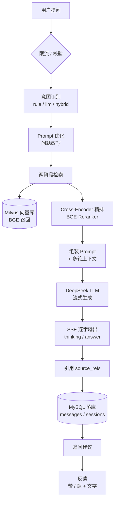
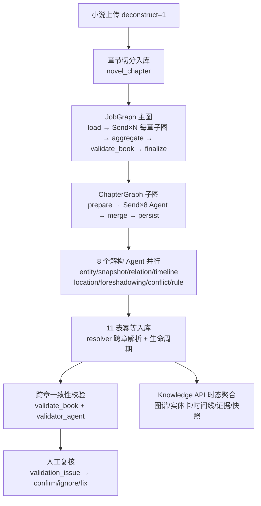
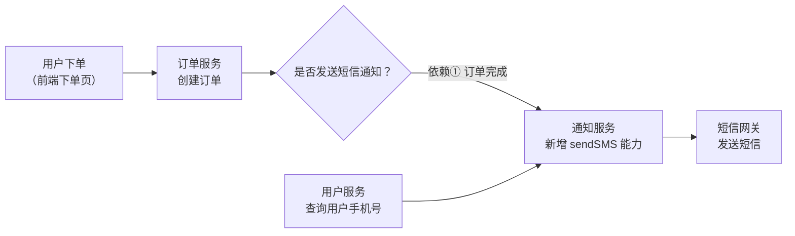

# 项目说明（AI 智能客服 + 小说解构知识图谱系统）

## 1. 项目概述

本项目是一个基于大语言模型（LLM）的**双子系统**系统：**① 企业级 AI 智能客服 + RAG（检索增强生成）**——用户把企业知识文档（`.txt` / `.md` / `.pdf`）上传后，即可通过自然语言问答获得**带引用来源的流式回答**，并支持多会话、反馈、意图识别与追问引导，让知识库真正可运营、可闭环；**② 小说解构 / 知识图谱**——用户把小说上传后，系统用 LangGraph 图编排 + 9 个解构 Agent 逐章把小说解构成结构化知识（实体/快照/关系/时间线/地点/伏笔/冲突/规则），经一致性校验与人工复核后，提供知识图谱浏览、实体百科、时态回放与数据浏览。

**核心能力一句话**：上传知识 → 问答 → 引用 → 反馈/追问（客服）；上传小说 → 解构 → 图谱/百科浏览 → 复核（解构）。

**内置测试数据**：系统内置 demo 账号 `12345678910 / 1234567`，首次启动会自动把 `docs/start_files/` 下 3 份示例文档（公司产品介绍.txt、常见问题FAQ.md、退换货政策.txt）经真实导入路径（documents 状态机 → MCP `RAG_init_collection` → Milvus）导入到该用户，book_name 为「示例知识库」。登录即可直接体验问答，无需先手工上传文档——呼应笔试题「数据初始化建议」（预置 2-3 篇示例文档 + 初始化自动向量化）。

---

## 2. 技术选型及原因

| 技术 | 版本 | 为什么选它 |
| --- | --- | --- |
| **FastAPI + SSE** | 0.140 | 原生异步 + 类型校验，天然适配 SSE 流式输出；`StreamingResponse(media_type="text/event-stream")` 实现逐 token 推送，是 AI 对话产品的体验基础 |
| **Vue 3 + Vite** | 3.5 / 6 | 组合式 API 适合 SSE 流式状态管理；Vite 开发热更新快。**使用 JavaScript**（题目建议 TS）：团队熟悉度与交付节奏优先，类型负担通过接口文档与测试弥补 |
| **MySQL 8.0** | 8.0 | 用户/会话/消息/知识库元数据的关系型存储，事务与索引成熟；SQLAlchemy 2.0 ORM 管理 |
| **Milvus 2.6** | 2.6.19 | 高性能向量检索引擎，IVF_FLAT + COSINE（nlist=128、dim=512），支撑千万级向量检索；Docker 一键部署 |
| **BGE** | bge-small-zh-v1.5 / bge-reranker-v2-m3 | 中文语义检索领先且本地可部署（sentence-transformers 5.6）；Embedding + Cross-Encoder 两阶段检索兼顾速度与精度 |
| **DeepSeek** | deepseek-v4-flash | OpenAI 兼容 API、成本可控，支持深度思考模式，经 `openai` SDK 接入；同时作为**解构 Agent 的结构化抽取 LLM**（低温 0.0，保证 JSON 输出稳定） |
| **LangGraph** | 1.x | 解构流水线的图编排框架：JobGraph（整书）+ ChapterGraph（单章）两级 StateGraph，`Send` 并行扇出 + reducer 归约 + InMemorySaver 断点 |
| **MCP 工具设计开发** | fastmcp 3.4.4 | 设计并开发 RAG 检索/入库/删除 + 天气共 4 个 FastMCP 工具，由 LLM 经 Function Calling 动态调用；**子进程常驻**，Milvus/Embedding/Reranker 只加载一次，避免每次调用重建 |
| **LangChain** | 1.3.13 | 复用其 ChatModel 抽象、消息结构、文本分块器，降低 RAG 拼接成本；核心链路逻辑仍自行实现（见 §3） |
| **python-jose（JWT）** | 3.3.0 | 无状态令牌认证（HS256），前端 localStorage 携带，配合 bcrypt 密码散列 |
| **pytest** | 8.3.2 | 395 个用例（57 个测试文件，2026-08-18 实测）覆盖 auth/qa/documents/sessions/intent + 小说解构全链路，作为质量兜底 |

选型主线：**"前端体验（SSE 流式） + 后端可工程化（FastAPI/MySQL）+ 检索质量（Milvus/BGE 两阶段） + 成本可控（DeepSeek/MCP 常驻）"**。

---

## 3. 整体 AI 架构图



链路逐段说明：

1. **限流 / 校验**：每用户每日提问上限（`DAILY_QUOTA=100`），超限返回 429；单次提问 ≤ 500 字。
2. **意图识别**：先对问题分类（产品咨询 / 售后问题 / 闲聊 / 投诉 / 其他），`hybrid` 模式规则优先、LLM 兜底，零成本且确定性高。
3. **Prompt 优化**：问题改写（剥离指令注入、保留真实意图），减少 LLM 误解与幻觉。
4. **两阶段检索**：BGE 向量召回 top-50 → Cross-Encoder 精排 top-5，兼顾召回率与精度。
5. **组装 Prompt**：系统提示词 + 检索结果 + 最近 10 轮上下文（3000 字预算）拼接。
6. **LLM 流式生成**：DeepSeek 深度思考 + SSE 逐字输出，thinking 与 answer 分开推送。
7. **引用溯源**：回答携带 `source_refs`（来源文件 / 书名 / chunk_id），前端以引用卡片展示。
8. **落库**：消息与会话写入 MySQL，支持历史回看与反馈。
9. **追问建议**：回答结束后生成可点击的追问问题，形成闭环。

**解构子系统链路**（小说解构 / 知识图谱，详见 §4）：



链路逐段说明：

10. **章节切分**：小说上传（`deconstruct=1`）或一键解构时，把章节原文写入 `novel_chapter`，超长章切成多个场景。
11. **LangGraph 图编排**：JobGraph 按章并行扇出，每章一个 ChapterGraph 子图；子图内 8 个解构 Agent 并行抽取。
12. **解构 Agent**：实体 / 快照 / 关系 / 时间线 / 地点 / 伏笔 / 冲突 / 规则，每场景一次 LLM 调用，JSON 强校验 + 缩窗重试。
13. **幂等入库**：resolver 跨章解析 name→entity_id，11 表按业务唯一键 upsert，关系/冲突/规则做跨章生命周期合并。
14. **一致性校验 + 人工复核**：Layer 0/1/2 校验拦截可疑项写 `validation_issue`，复核工作台对照原文证据裁决，confidence 闭环。

---

## 4. 小说解构子系统设计

### 4.1 定位

小说解构子系统把一部小说"逐章解构"成可查询、可回放、可复核的结构化知识图谱。相比 RAG 的"向量召回 + 生成"，解构走的是**结构化抽取**路线：用 LangGraph 图编排 + 多个 Agent 从每章原文抽出实体、关系、时间线、地点、伏笔、冲突、规则，落库后支撑图谱浏览与实体百科。核心代码在 `backend/src/novel/`。

### 4.2 流水线结构

- **LangGraph 两级图**：JobGraph（整书）→ `Send×N` 每章一个 ChapterGraph 子图 → 子图内 `Send×8` 并行 Agent。`Send` 并行扇出 + `operator.add` reducer 归约（并行分支各自 append、fan-in 自动汇总），`InMemorySaver` 断点快照。
- **任务状态机**：`deconstruct_job`（pending→running→done/failed）+ `deconstruct_chapter_state`（每章 pending→processing→done/failed），乐观锁认领防多进程双抽，租约回收僵死章，断点续传只重跑未完成章。

### 4.3 8 个并行解构 Agent + validator

| Agent | 抽取内容 |
| --- | --- |
| entity | 实体（7 类枚举）+ 别名 |
| entity_snapshot | 每实体本章状态 + 属性 |
| relation | 实体关系（10 类枚举 + 时效） |
| timeline | 剧情时间线（stage/event 两级）+ 参与实体 |
| location | 地点层级 + 本章地点状态 |
| foreshadowing | 伏笔埋设/回收 |
| conflict | 冲突核心（双方 + 状态） |
| rule | 设定规则校验点（cap/cost/balance_lock） |
| validator | 一致性校验（Layer 2，可选，`NOVEL_VALIDATOR_ENABLED`） |

**Prompt 契约**：每个 Agent 一个 prompt（`prompts/*.py`），结构 = 公共前置铁律（只按原文/只出 JSON/不编造）+ 任务 + 枚举 + 约束 + **3-shot 跨题材示例（2 正 1 错）** + 原文。输出用 Pydantic 强校验（`llm_runner`），JSON 非法或校验不过 → **缩窗重试**（取前 1/2^level，最多 2 次），保证结构化抽取稳定。

另有**增量提取与跨章对齐**：`entity_snapshot` 的 `build_prompt(..., prev_snapshot_context=...)` 注入该书该实体**最新已入库**快照摘要（章节并行解构时可能非紧邻上一章），约束"本章原文明确描述必须完整输出、未提及字段从快照沿用"，省 token 且让状态演进可追踪；`hint_entities` 由 `resolver.build_hint_entities` 建全量跨章命名名单注入各 Agent，防止同物异名（DB 层 `entity_alias.uk(book_id, alias_name)` 兜底）。

### 4.4 幂等入库与跨章解析

- **resolver 跨章解析**：实体按"名"跨章解析为 `entity_id`（`entity_alias.uk(book_id, alias_name)` 保证同书一个别名只归一个实体）；事件按标题复用 `event_id`。
- **11 表幂等入库**：各表业务唯一键 `uk_*` + ON DUPLICATE KEY UPDATE；单条/单批 savepoint 隔离（`_safe`），失败记 `validation_issue(persist_error)` 不整章回滚（007 C1，鲁棒性见 `分析文档/007`）。
- **跨章生命周期**：关系 MERGE/CLOSE/OPEN（区间 [start,end]）、规则同名 MERGE（不 close+open，见 `分析文档/006`）、冲突同标题 MERGE（解决→end 定值，重新出现→end 清 0）。
- **时态 as-of N**：快照按章回填（`get_latest_snapshot_at_chapter`）、关系按区间过滤（`get_valid_relations_at_chapter`），支撑图谱/实体卡按章节回放。

### 4.5 一致性校验与置信度闭环

- **Agent 可靠性体系（Guardrails）——三层校验**：Layer 0/1（章内：schema/字段/source_fragment 原文锚定/状态连续性，见 `分析文档/010`）+ Layer 1（跨章：timeline 有序 / 快照翻转需事件支撑 / cap 矛盾需 balance_lock）+ Layer 2（validator_agent 批处理，`NOVEL_VALIDATOR_ENABLED` 开关）；配合 confidence 置信度闭环、savepoint 隔离（007 C1）与乐观锁多进程守卫（§4.2），构成生产级 Agent 可靠性兜底。
- **复核闭环**：拦截项写 `validation_issue(pending)`（保留原值、挂起新值）→ 复核工作台对照原文证据（±200 字窗口）裁决 → confirm/ignore/fix 写回目标知识行（`review_status` + `confidence=1.0`）。
- **实体卡饱满度（二阶段已落地）**：按 `分析文档/014` 的"戏剧生命"方向实现——实体卡 **L0-L4 五区**（身份锚点 / 静态基线 / 当前状态 / 聚合弧光 / 伏笔规则·明暗）+ **三态标注**（原文直证 / 合理推断 / 待复核）+ **状态累积回填**（逐属性最近非空）+ 置信度弱视觉；快照演化时间轴呈现成长轨迹（含突破/转折标注）。

### 4.6 Knowledge API 与前端工作台

- **Knowledge API**（`/api/novel/books/{id}/knowledge/*`）：graph（1-hop 图谱）、entities/{id}（实体卡）、timeline、evidence、snapshots，均支持 `chapter` 时态参数。
- **前端解构工作台**（`/deconstruct`，5 tab）：解构（任务与进度 SSE）/ 复核（证据分屏裁决）/ 图谱（1-hop 关系图）/ 百科（实体卡 + 快照时间轴 + 热力图）/ 数据（10 类浏览筛选）。

### 4.7 可观测性（事件总线 + SSE 进度流 + request_id）

- **事件总线**：`events.py` 是进程内发布/订阅总线——`publish(event)` 广播 `job_started`/`chapter_started`/`scene_started`/`agent_started`/`agent_done`/`agent_failed`/`chapter_done`/`chapter_failed`/`job_done`/`job_failed` 等事件；`subscribe`/`unsubscribe` 按 job_id 过滤，订阅者异常 try/except 隔离（一个订阅者断开不拖垮流水线）。
- **SSE 进度流**：`GET /api/novel/jobs/{job_id}/stream` 订阅事件总线，实时把 job/chapter/agent 三级进度推给前端（同时每 1s 轮询 `deconstruct_job` 补发 `progress` 计数），事件类型见《API文档.md》§9.6。
- **request_id 链路追踪**：`core/logging_conf.py` 用 `ContextVar` + HTTP 中间件为每个请求注入 `request_id`（响应头 `X-Request-Id`），全部日志带该 id，可跨"前端 → API → 事件总线 → 图节点"定位一次完整解构请求。

---

## 5. AI 工程问题思考（重点）

### 5.1 检索为空：为什么"模型知识降级 + 免责"优于"硬回兜底"

**怎么想**：知识库未命中时，用户仍期待一个有用回答。直接回兜底话术（"暂无相关信息"）体验差；但直接硬编造又违反"不编造"原则。权衡后采用**两段降级**：

- **第一段**：检索为空 → 切到"模型自身知识"模式（`knowledge_mode: model`）再调一轮 LLM，用 `system_prompt_free` 约束"不编造企业内部政策细节、不确定须如实说明"，回答标注"以下为一般信息，非官方政策依据"。
- **第二段**：模型知识也未产出 → 才回 `FALLBACK_COPY` 兜底话术。

**为何这样处理**：把"空检索"从硬失败变为"可降级"；用免责标注对冲模型幻觉风险；兜底话术保证永不静默。

### 5.2 上下文超长：为什么"最近 10 条 + 3000 字截断"

**怎么想**：多轮上下文全量带入会超出模型窗口、推高成本与延迟，且早期信息对当前回答价值递减。取舍标准是**在"有用上下文"与"成本/过载"之间取平衡**。

**处理**：`HISTORY_RECENT_TURNS=10`（只保留最近 10 轮）+ `CONTEXT_MAX_CHARS=3000`（全局字符预算，从最旧完整消息开始丢弃，当前提问始终保留）。两把尺子：轮次维度 + 字符维度，避免"条数够但单条爆长"。

### 5.3 LLM 幻觉：为什么"引用溯源 + Prompt 约束 + 空检索不编造"三层

**怎么想**：幻觉是 LLM 问答的头号风险。单靠提示词约束不可靠，需要**结构化溯源**做事实锚点：

- **引用溯源**：回答的每个 `answer` 事件都带 `source_refs`（仅存 `{book_name, file_name, chunk_id}`，按 chunk_id 去重），前端以引用卡片展示，用户可核对答案来源。
- **Prompt 约束**：系统提示词明确"仅基于检索结果回答，禁止编造、禁止推断检索结果之外的事实"；未命中必须如实说明，不得罗列来源文件名（引用由前端卡片承担）。
- **空检索不编造**：无命中时走 §5.1 的降级 + 免责，而非让模型自由发挥编造企业知识。

**权衡**：引用溯源增加了一点存储与前端复杂度，但换来"答案可核对、错误可追责"，对企业场景是必要的。

### 5.4 大规模知识检索下的 LLM 执行保障（加分项）

企业级场景下知识库文档很多，检索返回的相关片段与业务规则可能达数十条。核心认知：**不是"塞得更多"，而是"管好上下文 + 强制证据锚定 + 生成后校验"**——单纯扩上下文不解决注意力稀释，反而加剧（"lost in the middle"：prompt 中间信息最易被忽略；低分噪声挤占高分证据位置）。

#### 5.4.1 问题本质（两个失败模式）

| 失败模式 | 根因 | 后果 |
| --- | --- | --- |
| 注意力稀释 → 漏规则 | 检索片段多 → 上下文被结构噪音污染，关键证据被推到低召回区（U 形曲线中间位） | 关键规则未被引用 |
| 信息过载 → 幻觉/混淆 | 模型偏向内部参数化知识；多条相似规则混入时引用错位 | 编造规则 / 混淆相似规则 |

共识：需要四类杠杆——压缩（去噪）+ 定位（把关键放高召回位）+ 强制证据锚定（引用编号）+ 生成后校验（闭环）。

#### 5.4.2 设计思路（五层机制）

**L0 检索补强【已实现】**
已具备：Top-K 收口（`TOP_K_RETRIEVE=50` / `TOP_K_RERANK=5`）、质量门控（`RAG_MIN_COSINE_SIM`）、`book_id` 隔离、BGE 两阶段检索、`source_refs` 引用捕获。**设计稿**：多路检索（向量 + 关键词）RRF 融合、metadata 过滤（按文档类型/章节预筛），从源头提高候选集信噪比。

**L1 规则卡片层【设计稿】（治"注意力稀释"）**
把每条检索片段先结构化，而非原文全塞：

```
RuleCard = {
  rule_id: "R3",                            # 序号（供强制引用）
  source:  {file_name, chunk_id, snippet[:200]},  # 证据锚点（复用 source_refs 结构）
  priority: 0.92,                            # 优先级分
  summary: "退款需 7 天内且发票齐全",         # 一句话摘要
  detail:  "…完整片段原文…",                 # 明细（默认不展开）
}
```

- **抽取式而非摘要式**：政策/契约类规则保留原文，避免摘要引入幻觉。
- **优先级打分**：`priority = α·rerank_score + β·规则类型权重（退款/安全/政策 > 泛化）+ γ·查询相关性`。
- **分层**：prompt 默认只放"摘要层 + top-N 明细"，N 由 `CONTEXT_MAX_CHARS` 预算决定；超出预算的规则直接剔除（不占位、不稀释）。
- **U 形定位**：优先级最高的规则放 prompt 开头、次高放结尾（高召回位），其余居中——廉价的"抗 lost in the middle"技巧。

**L2 Prompt 强制证据锚定【部分实现 → 设计稿】**
现有 System Prompt 已有「仅基于检索结果回答，禁止编造」「结论 + 不确定项」结构化约束。**设计稿**补三条硬约束：①每条回答必须带 规则编号 + 来源，只允许引用给定的 `R1..Rn`、禁止自造编号（混淆即"答非所引"，可机器识别）；②某方面检索不到必须显式声明"知识库暂无相关规则"；③答案按 `{结论, 依据:[rule_id], 不确定项}` 结构化输出（JSON 约束，便于机器校验）。注意：强制引用 > 鼓励自由思考（自由 CoT 反而抬升无支撑内容）。

**L3 分步校验层【设计稿】（闭环，治"漏"与"编"的漏网之鱼）**
生成后用一次轻量独立校验：把答案拆成原子 claim（每条一句）→ 逐条对齐证据（claim 里的 `rule_id` 是否存在于本轮检索；存在但内容与 detail 矛盾 = 混淆）→ 三种处理：通过 / 证据缺失→降级标注"不确定"或改写"知识库暂无" / 矛盾→重生成（强调只看证据）。校验在生成后执行，以 SSE 追加事件或落库呈现，不打断流式体验。

**L4 运行护栏【已实现 + 设计稿】**
已实现：`source_refs` 落库（`messages.source_refs`），前端引用卡片可点开核对——幻觉"可见可验证"。**设计稿**：校验层"无证据 claim 比例"作为遥测指标逐轮落库、超阈值告警；`rule_id = book_id + chunk_id` 天然可追溯（唯一真源 = documents 表）。

> 当前状态小结：L0 基础与 L4 溯源已实现；L1 规则卡片、L3 分步校验、L2 的编号强制引用为**设计稿**（对应"项目代码里面实现更好"的加分项，作为后续增强，不虚构为已实现）。

#### 5.4.3 效果验证方式

1. **离线对抗性测试集**（最能证明机制有效）：
   - 埋藏关键规则：10+ 条规则里把 1 条"关键但易被埋没"的放检索结果中间位 → 测是否被引用（关键规则召回率）。
   - 相似混淆：A/B 两条规则仅一字之差（如"7 天内退货" vs "7 天后退货"）→ 测混淆率（引用错 rule_id 比例）。
   - 不存在规则：问知识库没有的问题 → 测幻觉率（编造 rule_id/事实比例）。
   - 对比基线：naive（全片段塞入、无卡片无校验）vs 本机制，用 LLM-as-judge + 人工抽查。
2. **运行期遥测**：校验层"无证据 claim 比例"逐轮落库，作为持续质量指标；配合消息赞/踩做间接验证。
3. **pytest 集成用例**：构造"故意埋规则 + 故意混相似规则 + 故意问不存在"的检索 mock，断言答案引用正确的 `rule_id`、未引用伪造编号、未编造未检索内容——把设计变成可回归的机器检查。

**权衡与边界**：压缩率 4x 起步（政策/契约类用抽取式保原文）；校验成本 = 多一次 LLM 调用，仅当检索片段 > K 条或答案超长时触发；校验不破坏 SSE 流式协议。

### 5.5 LLM 结构化输出鲁棒性（解构侧）

解构侧每个 Agent 的 LLM 输出必须落库为结构化 JSON，鲁棒性直接决定抽取成功率。`llm_runner.extract` 用四道保障把"LLM 输出不可靠"兜成"可重试、不放脏数据"：

1. **JSON 容错解析**（`_parse_json_strict`）：剥 ```json 围栏 → 整段 `json.loads` → 取最大平衡 `{}` 块 → 数组外壳 `[{}]` 包裹 → 都失败才抛 `JSONDecodeError`。LLM 常见的"前后杂讯 / 截断 / 单元素裸写"都能救回。
2. **Pydantic 强校验**：`schema.model_validate(data)`——结构不合法 = 失败（不放脏数据入库），字段级错误信息回传（`_retry_feedback`）。
3. **缩窗重试**：JSON 非法/校验不过 → `_shrink(scene_text, level)` 取前 `1/2^level`（level=1 前一半、level=2 前四分之一），最多 `NOVEL_AGENT_MAX_SHRINK=2` 次；每次把字段级反馈拼进下一次 prompt。
4. **低温定长**：`DECONSTRUCT_LLM_TEMPERATURE=0.0`（低随机）+ 超长章先切场景（`NOVEL_CHAPTER_MAX_CHARS=10000`）保证输入定长，从源头压低 JSON 漂移。

**权衡**：缩窗会丢弃后半章信息（场景切分已把信息分窗兜住）；四道保障以"最多 2 次重试"的成本换"几乎不落脏数据"——配合 §4.5 的三层校验与复核闭环，把解构产物质量兜在生产级。

---

## 6. AI 编程工具使用体会（必须）

本项目全程以 **Claude Code（AI 编程助手）+ DeepSeek（LLM API）** 协作完成。核心认知：**AI 是"执行者 + 审计者"，我是"编排者 + 验收者"**——给 AI 清晰的地图（Spec）与过程（流水线），而非放任自由发挥。

### 6.1 工具与协作方式

- **Claude Code**：编码、重构、文档、测试生成的编程助手，运行在本地仓库，能读代码、跑命令、看测试。
- **DeepSeek**：作为系统内的 LLM（智能客服回答生成），也是意图识别/追问的兜底模型。
- 协作定位：**AI 编排者**——先由我拆解任务、写 Spec、定验收，再由 AI 逐 Spec 执行，最后我审查 + 测试验收。

### 6.2 如何用 VibeCoding 生成代码

- 把需求拆成 **AI 友好的小任务**（≤1 个模块 / 1 个接口），对齐 `spec模版规约` 的"粒度一个模块/接口"。
- 每个任务一份**执行 Spec**，明确：上下文边界（可复用组件、禁止修改范围）、输入输出契约、可量化验收、禁止行为清单。
- 要求 AI **输出 diff 而非整文件重写**；先出方案、确认后再编码；每份 Spec 配套 pytest 用例。

### 6.3 如何审查 AI 写的代码

- 用**流水线 Step 5 Code Review** 清单：硬编码路径、异常分支、日志清晰、文档同步；`git diff master` 查无遗留调试代码。
- **"双人 review"**：人审 + 测试兜底（`pytest` 395 用例 + 流水线 4a/4b/4c 功能验证）。
- 让 AI 自列**假设与风险**，当作"审计者"再审一遍自己的代码。

### 6.4 如何操控上下文有限的 AI 拆分大工程

- **00-顶层计划 → 6 份子任务执行 Spec（01-06）→ 逐 Spec 执行**：每个 Spec 是独立会话、上下文有界（`spec模版规约` 的 9 节模板控制 AI 行为范围）。
- 每 Spec 提交一次（git 提交名 = Spec 名，如 `02-子任务-B-核心问答链路（执行 Spec）`），作为检查点。
- 规则文件（`spec模版规约.md`、`开发流水线步骤.md`）沉淀项目约定，让 AI 每次复用而非重述。
- 问题出在"上下文不够"时，不靠一次长对话硬啃，而是拆成新的顶层计划外 Spec 治理（见 §6.6）。

### 6.5 如何保证 AI 代码上线可用

用**开发流水线 7 步**（Step 1 编码 → 2 构建 → 3 启动 → 4 功能测试（4a 存量 / 4b RAG / 4c 前端）→ 5 Code Review → 6 合入 + 打 Tag → 7 文档同步），并按改动类型精简（只改文档走 6+7；改后端走 2+3+4a/4b；改前端走 2+3+4c）。原则：**主分支始终可部署、Tag 可回滚**。

流水线文档还记录了 **4 个"没有流程的后果"真实事故**：CMD 用 `main:app` 而非 `main_fastapi:app`（缺 Step 2 Build 拦截）；Milvus 健康检查用 `curl` 但镜像内没装（缺 Step 3 Deploy）；`HF_HUB_OFFLINE=1` 阻塞首次部署（缺 Step 4 Test）；第二轮 answer 被前端 `hasContent` 吞掉（缺 Step 5 Review + Step 4c）——每个都是流程兜底的实证。

### 6.6 构建 RAG 链路时对 AI 生成代码的优化修正（举例）

每个例子说明"AI 初版错在哪、我改了什么、为何这样改"：

1. **入库 chunk_count 回填优化**（提交 `197a19f`）：AI 初版在入库后实时二次查询 Milvus 统计 chunk 数，但 `auto_flush=False` 下刚写完读不到（数据可见性竞争）→ 全为 0。改为让入库工具**直接带回逐文件计数**（`(success, fail, per_file)`），主路径不再二次查询；仅工具未上报时走 flush+批量查询防御回退。**从根上消除可见性竞争**。
2. **入库去重按书隔离 + 全去重删行**（提交 `a9bbccb`）：AI 初版 `content_hash` 对整个集合去重、不按 book_id 过滤 → 跨书相同文本被静默丢弃；且全去重时"成功 0"被伪装成成功、重复上传的 MySQL 行持续增长。改为**按 book_id 隔离去重**、`count==0` 时删除本次新建的 processing 行、整批全重复时输出 WARNING"成功 0"。**数据治理正确性**。
3. **source_refs 精简 + 引用去重 + 溢出修复**（提交 `feacfd0`）：AI 初版把每个引用 snippet 全文写入 `source_refs` JSON（数百引用时超 TEXT 上限 64KB 写库失败），且相同 chunk 不去重。改为只存 `{book_name, file_name, chunk_id}`（体积从 ~220 降到 ~60 字符/条）、按 chunk_id 去重、列类型 TEXT→MEDIUMTEXT。**存储健壮性**。
4. **fetch+SSE 逐帧渲染修复**（提交 `19011fd`）：AI 初版前端用单一 `hasContent` 标志判断追加，工具调用产生的第二轮 answer 到达时被误判丢弃（后端已取到结果但前端不展示）。改为**逐事件判断 `last.role/type` 决定可否追加**，thinking/answer 各自独立处理。**流式体验正确性**。
5. **意图识别规则优先 + LLM 兜底**（提交 `c7b29da`）：让 AI 实现意图分类时，明确 `hybrid` 模式 = 规则词典优先（投诉 > 售后 > 产品咨询 > 闲聊）、未命中才走 LLM 兜底，兜底失败回退默认类且不阻塞主链路。**降级与确定性**。
6. **docker-compose 部署路径修复**（提交 `37cd6f1`）：AI 初版挂载的 `init_db.sql` 路径随目录迁移失效、残留 `story` 挂载、`MILVUS_PORT` 等占位符未在 compose 覆盖。改为路径同步 + 补 `MILVUS_PORT/MYSQL_PORT` 覆盖 + `DeepSeek_API_URL` 非敏感默认值 + frontend `depends_on: service_healthy`。**部署可复现**。

以上修正均沉淀为 `docs/开发阶段文档/spec/顶层计划外/` 下的 13 份设计文档（每份写明定位"顶层计划之外的设计文档"），并有代码与 pytest 用例佐证。

### 6.7 如何评估验证 RAG 回答质量

- **人工测试用例**：命中检索、空检索降级、500 字边界、每日限流、引用卡片展示，逐条在前端验证。
- **自动化兜底**：`pytest` 395 个用例（57 个测试文件，2026-08-18 实测）断言关键链路与错误形状（auth/qa/documents/sessions/intent/mcp/prompts/text_splitter + novel 解构全链路）。
- **检索质量门控**：`RAG_MIN_COSINE_SIM` 相似度阈值（`1 - vector_score`），可校准"太低→垃圾进、太高→该命中不命中"的平衡。
- **观察与迭代**：在对话页实际提问，观察引用命中与空检索行为，反推 Prompt 与检索参数（Top-K、阈值）调整。

---

## 7. 终极挑战：AI Agent 的任务拆解能力

### 题干

> 在真实的研发团队中，一个用户需求往往需要同时改动多个微服务（比如前端、用户服务、订单服务、通知服务等）。假设你有一个 AI Agent 负责根据用户需求自动编写代码，请思考并设计：当 Agent 收到一条需求（如"用户下单后自动发送短信通知"）和一整套系统的技术文档/接口文档后，它如何准确判断——这个需求需要改哪几个微服务？哪些改动可以同时进行（互不影响）？哪些改动必须按先后顺序来（有依赖关系）？

### 拆解思路

AI Agent 拆解需求的三步法：**① 需求词 → 领域归属 → 候选服务；② 分析服务间的调用/数据依赖；③ 按依赖关系排序，无依赖者并行。**

以"用户下单后自动发送短信通知"为例：



**依赖分析**：

| 改动 | 依赖 | 可否并行 |
| --- | --- | --- |
| ① 通知服务新增 `sendSMS` | 无（独立新增能力） | ✅ **可最先并行启动** |
| ② 用户服务提供手机号查询 | 无（已有用户数据） | ✅ 与①并行 |
| ③ 订单服务下单后调用通知服务 | **依赖①的通知能力** | ⏳ 必须等①就绪 |
| ④ 前端下单页（可选展示） | 无 | ✅ 并行 |

**判定逻辑**：Agent 先读技术/接口文档建立**服务依赖图**；对每个候选改动查"它调用的接口是否已存在"——不存在的先做（通知服务 `sendSMS`），存在的可直接并行；有调用链的（订单→通知）串行执行。最终产出：**任务清单 + 并行集 + 串行链**，交给 CI 分阶段落地。

（本项目当前为容器化单体：`frontend` / `backend` / `mysql` / `milvus` 由 docker-compose 编排；该拆解方法同样适用于单体内部按模块编排。）

---

## 附：系统边界

本说明聚焦"**为什么这样选、怎么想、怎么用 AI 做出来**"；接口契约见 `docs/API文档.md`、表结构见 `docs/数据库设计.md`、RAG 机制实现见 `docs/AI架构设计.md`、业务处理见 `docs/业务流程说明.md`、启动部署见根 `README.md` 与 `运行指南`。
